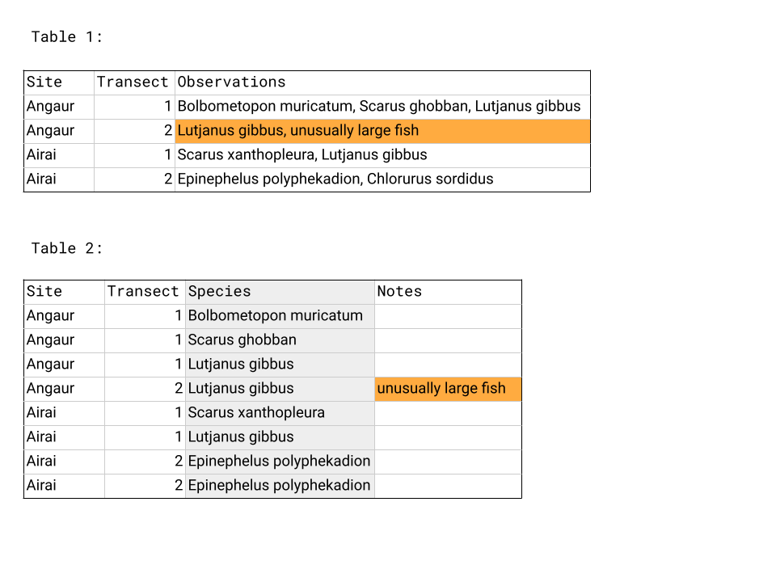
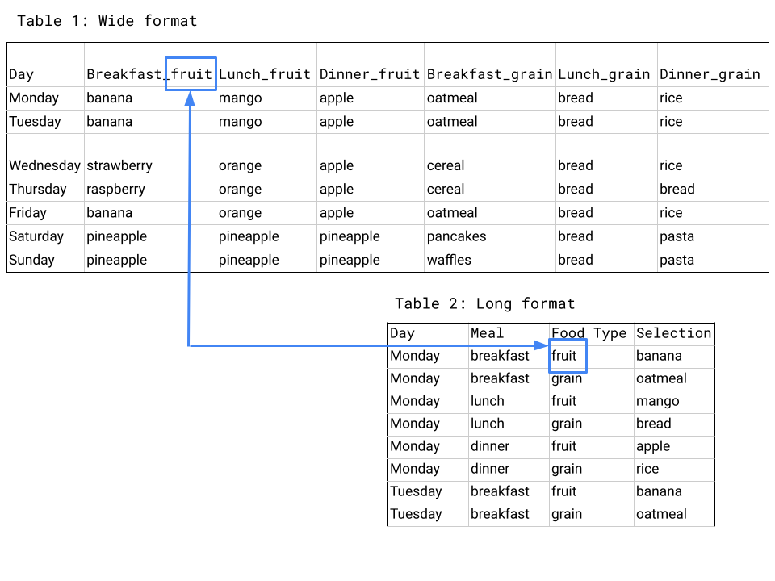

# Working with Data

## Data Management

***In this session ***

1. File naming
2. Storage
3. Metadata
4. Version control

### Learning objectives

1. Learn good practices to store, name and, keep track of different versions of your data files
1. Understand the importance of metadata and use a template to create your own format

### Value statement

1. Learning how to properly store, name, and version control your files is the basis to developing systematic procedures to analyze and visualize data. 
1. Creating metadata files is essential to capturing key information about the context and content of a data file. Every data file should be accompanied by its metadata. By doing this, you can enable others to better understand your data and work more efficiently.

### File naming

1. While there is not a unique way to properly name your files, it is important to be consistent within your organization. Some of the best practices to do this include:
    1 Use descriptive names that would make sense to any reader. For example, don’t use acronyms or abbreviations.
    1. Avoid the use of special characters, such as !@#$%^&*() and others, these are sometimes not supported by some software.
    1. Make consistent use of capitalization. Are you going to use capital letters in every word? Maybe only at the beginning of the column name? For example: My_File1.xlsx vs. my_file1.xslx. While none of them is wrong, it is good to choose one format and stick to it
    1. Use underscores instead of blank spaces, just as in the example above.
    1. If you want to keep track of versions, don’t use endings such as “final”, “v5”, etc. Instead, we suggest that you either use the date in format YYYYMMDD, or use a version control system, as we will see in a later section.
    1. Don’t start a file name with a number, though it is fine to use numbers elsewhere in the name, as in the examples above.

### Creating a working folder structure

1. It is important to create a folder structure that will allow you and your colleagues to easily organize and retrieve any files that you are working with.
1. There are some key principles to creating an efficient folder structure:
    1. Store your raw data in its own folder. Every time that you get new data, the first thing you should do is to create a backup by adding it to your raw data folder. This will allow you to always be able to come back to the original file and look for processing errors.
    1. Create a separate folder for “working” files. These are the files where you will change column names, clean data errors and merge multiple files when necessary. For example, if your team performs annual assessments of reef fish biomass, you may want to store separate files for each year, but combine them in a “master” file, which should be located in your “working” files folder.
    1. Having a consistent file structure across projects, such as folders for script outputs or figures, can make it easier for colleagues and collaborators to understand where to find the files they need.

### Metadata

1. Metadata are documentation describing the content, context, and structure of data to enable future interpretation and reuse of the data. Generally, metadata describe who collected the data, what data were collected, when and where it was collected, and why it was collected.
1. Along with this class, we provided you with a metadata template. Please notice that this template can be adjusted to reflect your organization’s needs, therefore some of the requested information might change accordingly. Below, you will find an example of a filled out metadata template for the data that we will be using in Module 3.
1. Make sure to always share the metadata along with your data files. Some recommendations to do this include:
    1. If working in Excel, create a new tab named “metadata” and put the information there
    1. If working in other data formats, create a new file with the metadata, store it in the same folder, and name it exactly the same as the data file, adding “_metadata” at the end.
 

### Version control

1. Version control is the process of tracking and organizing the changes you make to files over time. Throughout the lifetime of a project, using a system to keep track of different versions of your files and how and why you changed them can make it easier to revert to earlier versions of files or work collaboratively on the same files. Software like Git and the associated interface GitHub provide a version control framework, particularly useful for code scripts. If you are interested in learning more about Git and GitHub, [this lesson](https://nceas.github.io/oss-lessons/version-control/1-git-basics.html) and [this portion](http://ohi-science.org/data-science-training/github.html) of a course from NCEAS, focusing on using Git with R, are some starting points. For a broader overview of reproducible science, including the utility of version control, see [this paper](https://www.nature.com/articles/s41559-017-0160) by Lowndes and colleagues. 

### Summary 
1. Well done, having a good folder structure, file naming practices, and version control capabilities are valuable tools to enable easy collaboration and to streamline workflows.
2. Remember that using metadata is extremely important, this is the only way to make sure that you and your team know exactly what is included in a data file. Never share a database without its corresponding metadata.

## Data Cleaning

***In this session ***

1. Learning objective
1. Value statement
1. Benefits of clean data
1. Data types
1. Best practices
1. Common cleaning procedures
1. Summary

### Learning objectives

1. Learn the benefits of having clean data sets and best practices for organizing and naming in data sheets. 

2. Learn best practices for cleaning data files.

### Value statement

1. Maintaining clean data sets reduces errors, facilitates searching and analysis, and eases reuse. 

2. Creating clean data sets involves steps in setting up your data organization and in reviewing data before analysis.

### Benefits of clean data 
1. Let’s start by defining what we mean by “clean data”. Clean data are as consistent, complete, and accurate as possible. Cleaning data is the process of reviewing data sets to standardize formatting, remove duplication, and fix or remove inaccuracies before using or analyzing the data set.

2. Having clean data has many benefits: 
        - Reduces errors from redundant updates
        - Enforces data integrity
        - Helps you and future researchers handle large, complex datasets
        - Enables powerful search filtering
3. Much has been written on effective data management to enable reuse of data. The following two papers offer words of wisdom:
        - Some simple guidelines for effective data management. Borer et al. 2009. Bulletin of the Ecological Society of America.
        - Nine simple ways to make it easier to (re)use your data. White et al. 2013. Ideas in Ecology and Evolution 6.

### Data types
1. Before we get into cleaning data, let’s go over the different ways computers can classify data. The primary data types are

    - Numeric: integers, decimals
    
        - Any kind of numeric field, except Boolean (binary or true/false statements). Examples include integer, double, floating, etc.
        
    - Text: strings, including special characters
    
    - Yes/no, true/false
    
        - Also known as logical or boolean
        
    - Spatial Location: Coordinates, Country Name, City Name, ZIP code
    
    - Date and time

### Best practices: data sheet set-up, column names, and data values

1. In brief, some of the best practices to follow are:

    - Design your tables to add new observations as rows, not columns. A column should be only one variable and a row should be only one observation. 
    
        *For example, the first table in the box below does not follow this design. The highlighted box has information for two types of variables in it and the Species column has many rows with multiple observations listed. In the second table, the data has been reentered so that each column has only one data type - see the moved note in orange - and Species column now has only one observation per row.*
    
    - Name columns in a clear way that is easy for both people and computers to interpret.
        - Use descriptive column names that would make sense to any reader. For example, don’t use acronyms or abbreviations.
        - Avoid the use of special characters, such as !@#$%^&*() and others
        - Make consistent use of capitalization. Are you going to use capital letters in every word? Maybe only at the beginning of the column name?
        - Use underscores instead of blank spaces. 
        
            *For example: Number of fish -> Number_of_fish*
        
    - When entering data, make sure there is only one type of value in each column, for example all numeric values or all character strings.
    - As a good practice, we recommend that you and your organization agree on a format and follow it diligently. 

### Common cleaning procedures

1. When analyzing data, it is important to make sure that there has been a thorough check of the records to ensure that they are as clean and ready as possible. While there is no straightforward way to make sure that all data is clean (given the unique nature of each dataset), there are some guidelines that can be followed

1. This first set of recommendations deals with the overall structure of the database:
    - Verify that your column names follow the conventions state in the section above
    
    - Verify that there are no empty columns in your dataset, and if there are, eliminate them
    
    - If you have a column with the date, verify that it is in the right format and that your
software (e.g., Excel, Access, Tableau) is reading it accordingly.

        - Word of caution: when working with international collaborators, the standard date format is DD/MM/YYYY, as opposed to the standard date format in the US, which is MM/DD/YYYY.
        
        - Tableau can recognize different date formats. Sometimes it is easier to capture data in 3 separate columns, year, month, and day, which can then be linked together directly in Tableau.
        
    - Verify that your database is in long format, as opposed to wide format.
    
        - Wide format is a condensed way of presenting data but contains observations in both the column headers and the entered values. Also called block format, wide format is sometimes how data is collected in the field and can be an efficient way of presenting data in a table in a report but is less useful for analysis. 
        
        - In long format, columns only include the type of data and not any information about your actual observations. Having information about your observations in the column headers makes it hard to use that information when analyzing data in Tableau or coding software like R. 
        
        - The same data set often has more rows and fewer columns when in long format compared to wide format, as you can see in the example below. Wide format presents the data efficiently - we can see the whole table - but contains information about the type of meal and type of food in the column headers, which is moved to the rows in long format.

3. Next, let’s explore some common methods to verify your individual data records:

    - If the column is numeric:
    
        - Verify that there are no text values
        
        - Plot a histogram with binned values in the x-axis and frequency in the y-axis. If there are very few observations for very low/high values, those are likely outliers or mistakes in the data, like the single high value in the example below. Find them in your raw data and decide whether it is something that you can fix
        
           
        - If the column is text:
        
            - Verify that there are no numeric values
            
            - Create a list with all the unique elements by using dynamic tables and sort them out in alphabetical order. From this list, verify that there are no leading or trailing spaces, misspellings, or typos. Get back to your raw data and correct accordingly.
            
        - Make sure that you distinguish between values that are zero and data that was not collected. Zeros should be used for values that were measured and found to be zero, for example the number of fish on a transect you swam but saw no fish. Data that was not collected, for example the number of fish you saw at a site you skipped sampling, should be recorded as NA or another symbol you use consistently throughout your data set. 

### Summary 

1. Congratulations! Once you have cleaned your data, you are ready to start analyzing it.

## Normalization and Standardization

***In This Session***
1. Learning objectives
1.1. Value statement
1.Introduction to tidy data
1.Normalization
1.Data organization
1.Standardization
1.Exercise
1.Summary

### Learning objectives

1.Understand the basics of tidy data, particularly normalization and standardization.
1.Learn how to design and create effective data tables.

### Value statement

1.Normalizing and standardizing data eases analysis and reduces errors. It is also the basis for having datasets that can be easily updated as more data becomes available.

### Introduction to tidy data

1.Tidy data describes a method of organizing databases and data tables that makes data analysis, searching, and reuse easier.
1.The tidy data approach is also known as the relational data model, which is used by relational databases like mySQL, Microsoft Access, and Oracle to store and organize data. If you’d like a more detailed look at the relational data model, see [this lesson] by NCEAS.
1.You don’t have to have a large and complex data set or be using a relational database, however, to see the benefits of having tidy data!

### Normalization

1.One characteristic of tidy data is normalization - a process of streamlining data structures and reducing redundancy. Normalized data are essentially data in the long format we discussed in the previous session: each column contains only one type of measurement, each row contains one observation, and data are stored in different tables such that each data point only appears once in the database. 
1. Three practices to keep in mind when designing your tables are:
    - Add rows, not columns, for new observations.
    - Put values for only one variable in each column.
    - Record each piece of data only once in the database. 
1.We covered the first two points in the previous session when discussing best practices for designing data tables. The third point addresses how you store your data in different tables and how they interact. To record each piece of data only once in your database, you need to have data at different scales stored in different tables that then link to one another.
    - For example, say you visit several sites and do multiple dives at each site. On each dive, you record the fish you see and information about each fish, such as species and length. In this case, you would store information about the sites in one table, information about each dive in another table, and information about the fish recorded on each dive in a third table. The schematic below shows these tables and how they relate.
        - After you have normalized your data and identified the relevant tables (e.g., sites, species and dives), there needs to be an identifier that serves as the link between each set of tables. In the example below, the Dive number links the Fish info table and the Dive info table - to get information about the dive when analyzing fish, you can pull the data from the Dive info table for the dive of the correct number. Similarly, Site name links the Site info table and the Dive info table
    

### Data organization

1.Once you have your data tables normalized, make sure that they are arranged in a way that a computer can easily interpret.
    - Make sure that each table has its own tab in a spreadsheet - multiple tables on the same sheet are hard for software programs like Tableau to read in and understand.
    - Do calculations, like statistics or marginal sums, outside of your data spreadsheet. They are not observations, like the other rows, but rather data analysis.

### Standardization

1. Once you have your data organized in a tidy fashion, it’s time to make sure the actual data values are standardized. Standardizing data involves many of the data cleaning steps from the previous session:
    - Checking that you use consistent entries for the same data values (“Yes” vs. “Y” vs. “yes” → choose just one).
    - Checking for data points that are outside the realm of possibility and are likely to be errors, like a dog recorded as weighing 500kg.
    - Verifying that all values within a column are the same data type.

### Exercise

1. Time to practice with an untidy data set! Use what you’ve learned about data cleaning to normalize and standardize the data set here. See the tidied version here.

### Summary

1. Well done! Now that you’ve learned about best practices for managing and storing data, it’s time to move onto Tableau.

