# Visualizing Data

## Tableau Basics

***In this Session***

1. [Learning Objectives](#tableau-basics-learning-objectives)
1. [Why Tableau?](#why-tableau)
1. [Installing Tableau](#installing-tableau)
1. [User Interface](#user-interface)
1. [Loading Data](#loading-data)
1. [Opening a File](#opening-a-file)
1. [Checking Data Types](#checking-data-types)
1. [Sheets](#sheets)
1. [Summary](#tableau-basics-summary)

### Tableau Basics: Learning Objectives

1. Get familiar with the user interface of Tableau.

1. Learn how to connect data sets to the Tableau interface.

### Why Tableau?

1. We are focusing on Tableau for two primary reasons: 
    - First, Tableau can read a variety of data types, as you will learn in this session. This means that many different software applications and assets can be combined in a single visualization to present to your audience. 
    - Second, Tableau is extremely intuitive. Once you get a grasp of the basic skills, you can create compelling visualizations of data in half of the time it would take in other coding software applications. 
    - Note: For this training, all the exercises and examples were done with Tableau version 2021.1. The menus may look slightly different in other versions of Tableau.

### Installing Tableau

1. Let’s get started with installing the software. To do so, go to 
https://www.tableau.com/ and select “Try Tableau for Free.”

1. Register your email address and username and download the software.

1. Once installed, input your key (you get one when you buy the software) and you are ready to go.

1. **Important note:** Tableau offers free 1-year licenses for educational purposes. If you belong to an academic institution, get a free license by going to https://www.tableau.com/community/academic. Once there, click on “Free student license”. You will need to provide information about your academic institution to validate your educational license. 

### User Interface

1. Let’s open Tableau! The image below is what you will see the first time you open Tableau. Once you start to save workbooks, they will populate here under **Open**. 

(a) The examples under **Sample Workbooks** are a great resource for inspiration to see the potential of Tableau. 
(b) This **Connect** column on the left is where you will load data. 
(c) The **Training** and **Resources tabs** are very useful to help you keep learning new skills. If you are interested in investigating or expanding your skills, we recommend starting with the materials in these tabs, rather than searching for other sources on the internet. The materials in these two tabs are very well thought out and provide step-by-step instructions on how to learn new Tableau skills.

### Loading Data

1. The most important section of this interface is the **Connect** menu, where you will load data. There are three main categories of sources that you can load into Tableau. 
    - [*Tableau Server:*](https://www.tableau.com/trial/tableau-server?utm_campaign_id=2017049&utm_campaign=Prospecting-PROD-ALL-ALL-ALL-ALL&utm_medium=Paid+Search&utm_source=Bing&utm_language=EN&utm_country=USCA&kw=tableau%20server&adgroup=CTX-Brand-Tableau+Server-E&adused=ETA&matchtype=e&placement=&gclid=c64d924d9b59166571a0f375554410ea&gclsrc=3p.ds&msclkid=c64d924d9b59166571a0f375554410ea) Data you have saved through your Tableau account. We will not cover that process in this course because most of the users of this training will probably not have a server setup explicitly for Tableau.
    - *Connecting to a local file:* Files from your computer can be Excel files, text files, statistical files, PDFs, and spatial files.
        - Text files include .csv .doc .log
            - You are going to be using **Text file** frequently if you have .csv (comma separated value) files. 
        - Spatial files are commonly referred to as shape files or GIS files. If you have ever dealt with shape files, you might remember that shape files are composed of a [few different files](https://gisgeography.com/arcgis-shapefile-files-types-extensions/) – some containing the coordinates, metadata, and a table. Tableau has made the adjustments necessary to load one shape file and all the associated files. 
            - As we will show this later in the course, you can load a shape file and Tableau will display it in a map with just a few clicks. 
    - *Connecting to a server:* You can connect to services that are online like Google Sheets, or Microsoft Office 365. 
        - One of the benefits of using this approach is that when you modify the original file, the modifications will be directly updated in Tableau. 
            - Let’s say you created a report with nice graphs in 2020 because that’s the data that you had when you created the report and then in 2021 you edited your Google sheet. The next time you open your Tableau workbook, all the data will be updated and contain the new data from 2021.  
            
1. It’s very important to make sure that you organize and manage your files such that you know exactly where your files are. Keep in mind that if you connect to a server, any changes that you make in the original file will have an impact on how your visualization looks in Tableau. 

### Opening a File

1. Create a new folder on your desktop. Name the folder “Tableau Data Training.”

1. Download this file: [CRM_Fish_edit](files/CRM_Fish_edit.xlsx) and save it in the “Tableau Data Training” folder.

1. Follow along with this video to connect the new data file to Tableau.
 
<iframe width="560" height="315" src="https://www.youtube.com/embed/EIItd2fpKDQ" title="YouTube video player" frameborder="0" allow="accelerometer; autoplay; clipboard-write; encrypted-media; gyroscope; picture-in-picture" allowfullscreen></iframe>

4. Progress check-in. So far, you have: 
    - Downloaded an excel file and connected it to Tableau.
    - In Tableau, you learned about drag and drop. As Alfredo always says, “Tableau is all about drag and drop.”
    - You connected the two tabs CRM_Fish and CRM_Site within the CRM_fish_edit Excel file—now in the Tableau interface. There is an orange line showing the connection. 

### Checking Data Types

1. When you load a data file, you have to check that Tableau properly labels the data types. Here, we will discuss what those data types are and how they are assigned in Tableau.
    - ***Dimensions and Measurements***
        - **Dimension** (also referred to as factor) is any information that is defined a priori of your actual sampling and helps to describe or categorize your results.  Whenever you can call something a category it is a factor. Depending on your data, factors are sometimes written as numbers, like year or site ID.
            - Example: Site name, species, habitat
        - **Measurements** are the actual results of your sampling. They are usually numbers that you went into the field to measure. 
            - Example: Fish size, population count, temperature
        - Tricky Case: Coordinates
            - Coordinates are a factor when you already know the coordinates where you are going to take your sample. Example: You have ten sites that you visit each year to count the number of whales. The coordinates of each site are a factor because they are predetermined. You know where you are going to gather data each time. 
            - Coordinates are a measurement when they are part of the information that you are recording and are not predefined. Example: you put a gps tracker on a whale and every time the whale surfaces, you record the coordinates. You did not know ahead of time where the whale would surface and the location is what the study is measuring. 
        - Tricky case: Is depth a factor or a measurement? 
            - Depth is a factor when indicating a transect location. Example: If you are always putting transects at either 3m or 30m you can categorize depth into shallow or deep. 
            - Depth is a measurement when it is recorded with every observation. Example: If you are swimming for 50 minutes to record visual observations of fish while also noting the depth at each observation, then depth is also a measurement. You measured and recorded your depth as you recorded the observation of the fish.
        - Practice exercise: Time
            - SCENARIO 1: Let’s say that you are birdwatching and you want to know what time of day birds are more active.  You count the birds and you write down the time that you see each bird. Is time a measurement or a factor?
                - Answer: Measurement because you are registering the time every time you see a bird.
            - SCENARIO 2: You want to know whether there are more birds in the morning, the afternoon, or in the evening.
                - Answer: In this case, time is a factor because you go out three times a day, you count all the birds you see at that time and categorize by morning, afternoon, or evening. 
    - ***Types of Data***
        - Different ways computers classify data:
            - Numeric - integers, decimals
                - Any kind of numeric field, except Boolean (binary or true/false statements). Examples include integer, double, floating, etc.
            - Text - strings, including special characters
            - Yes/no, true/false - Also known as logical or boolean
            - Spatial location - coordinates, country name, city name, ZIP code
            - Date and time. Tableau can recognize different date formats. One best practice is to separate fields for year, month, and day, which can be linked together directly in Tableau.

    - ***Discrete and Continuous Data***
        - **Discrete data** refer to variables that can only be conceptualized in a unitary manner. *It is quite similar to the difference between using many vs much. In this case, discrete data would be for things described as many*.
            - Example for text – color, name, city
            - Example for numbers – number of transects conducted, position in a ranking
        - **Continuous data** refer to variables that cannot be counted by units, but instead as continuous amounts. *Following the example above, continuous data would be for things described as much*.
            - Example: number of fish recorded, total biomass, height, depth
2. You should go through the preview of the data and ensure that each column is labeled correctly. 
    - *Note: Never skip this step even if you have worked with the data set in Tableau before!* 
3. The type of data is shown as symbols above the column title.

4. As you can see, the **ID** column is correctly labeled as a number; **Data entry** is a string (or text); and **Date** is a date (little calendar symbol). 
    - *Note: Remember string is a synonym for text in Tableau.*
5. To change the label, click on the symbol and a drop-down menu will appear. 
    - The **CRM_Fish** table should look like this:
    
    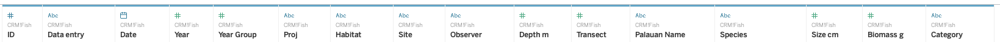
    
    - The **CMR_Site** table should look like this:
    
    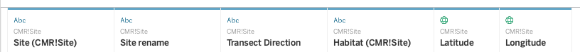
    
    - Notice that Latitude and Longitude are spatial data. If you open the drop-down, you will see that you can specify the type of spatial data provided under Geographic Role.  
        

### Sheets

<iframe width="560" height="315" src="https://www.youtube.com/embed/eFn2cfh6mtA" title="YouTube video player" frameborder="0" allow="accelerometer; autoplay; clipboard-write; encrypted-media; gyroscope; picture-in-picture" allowfullscreen></iframe>

1. Sheets Cheat Sheet
    - Discrete vs. Continuous
        - DISCRETE is Blue 
        - CONTINUOUS is Green
    - Factors vs. Measures 
        - Above the grey line is a FACTOR
        - Below the grey line is a MEASURE 
    
### Tableau Basics Summary

1. Great job! You have completed your first in depth Tableau session. Now, you know how to explore Tableau’s user interface, to connect a data file, check data types, and open sheets. 

## Tableau Skills Part 1: Basic Plots with Single Variables

***In this Session***

1. [Learning Objectives](#basic-plots-learning-objectives)
1. [Value Statement](#basic-plots-value-statement)
1. [Creating Your First Graph](#creating-your-first-graph)
1. [Basic Plots Using the Marks Menu](#basic-plots-using-the-marks-menu)
1. [Line Plot](#line-plot)
1. [Area Plot](#area-plot)
1. [Map](#map)
1. [Bubble Plot](#bubble-plot)
1. [Scatter Plot](#scatter-plot)
1. [Editing and Formatting the Axes](#editing-and-formatting-the-axes)
1. [Saving My Files](#saving-my-files)
1. [Homework Exercise](#homework-exercise)
1. [Summary](#tableau-skills-part-1-summary)

### Basic Plots: Learning Objectives

1. Explore the user interface.

1. Learn how to make basic plots and customize them.

1. Learn how to save and share workbooks.

### Basic Plots: Value Statement

1. Learning how to make basic plots in Tableau (e.g., bars, lines, pies, etc.) and how to take full control of the appearance will prepare you to take full advantage of Tableau’s more advanced skills.

1. *For this session we recommend that, if possible, you have two screens open—one with Tableau and one with the course material—so you can follow along with the exercises.*

### Creating Your First Graph

1. In the menu on the left, find **Habitat** under CRM_Fish

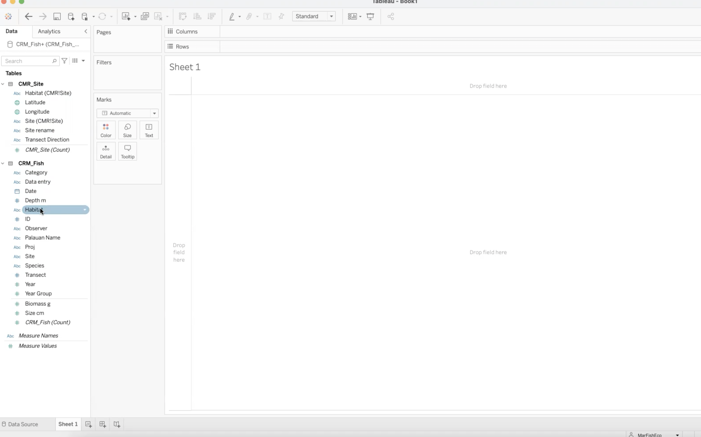

2. Drag and drop **Habitat** into **Columns**
    - This will place **Habitat** in the x-axis of the graph

3. Find **Biomass** under CRM_Fish

4. Drag and drop **Biomass** into **Rows**
    - This will place **Biomass** in the y-axis. 

5. Congratulations! You just made your first bar plot in Tableau! 

***Entire View and Sorting ***

<iframe width="560" height="315" src="https://www.youtube.com/embed/ni2hh248ffM" title="YouTube video player" frameborder="0" allow="accelerometer; autoplay; clipboard-write; encrypted-media; gyroscope; picture-in-picture" allowfullscreen></iframe>

***Show Me Menu***

1. The Show Me menu may pop up when you create a new graph. It looks like the image below. 

2. If the Show Me menu obscures your view, you can simply click on **Show Me** at the top and the menu will collapse. 

 

3. How to use the **Show Me** menu

<iframe width="560" height="315" src="https://www.youtube.com/embed/6FSgaXM__TE" title="YouTube video player" frameborder="0" allow="accelerometer; autoplay; clipboard-write; encrypted-media; gyroscope; picture-in-picture" allowfullscreen></iframe>

***Troubleshooting: Switching Rows and Columns***

1. Lilli has a question that came up when she was exploring the Show Me menu. When she tried to go back to a bar chart, the chart was flipped! Watch Alfredo’s answer: 

<iframe width="560" height="315" src="https://www.youtube.com/embed/DDjAZVewtUw" title="YouTube video player" frameborder="0" allow="accelerometer; autoplay; clipboard-write; encrypted-media; gyroscope; picture-in-picture" allowfullscreen></iframe>

### Basic Plots Using the Marks Menu

1. The Show Me menu is a great tool where Tableau can suggest automated graphs, but we want to teach you how to take full control of Tableau. In order to do that, we will utilize the Marks menu. 
    - The Marks menu is located to the left of your bar graph: 
    
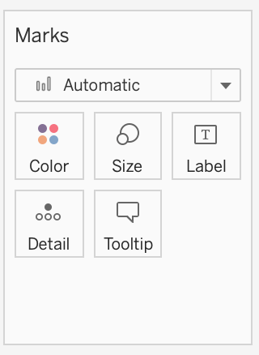

2. Color

    - Here you can customize the color, opacity, and border of your graph.
    
   
    - Click on **More colors...** and you will see even more options to customize your color palette. 
    
    - Practice: Insert a Hex Color 
        - Find the Hex Color field under **More colors...** 
            - For example, here is the “RGB Sliders” window on a Mac.
            
            - Type or paste **4EC5B1** in the Hex Color # 
            - Now, your graph should be this color:
            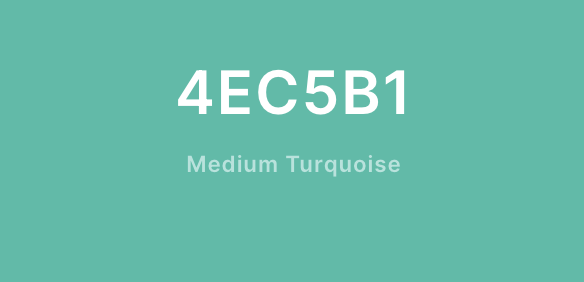

3. Size

    - If you click on Size, a slider will appear. In bar graphs, the slider changes the width of each bar. Let’s see how Size affects a pie chart.
        - First, name this sheet “Bars.”  REMEMBER TO ALWAYS NAME YOUR SHEETS   
    - To edit, double-click on the bottom where it says “Sheet 1”
    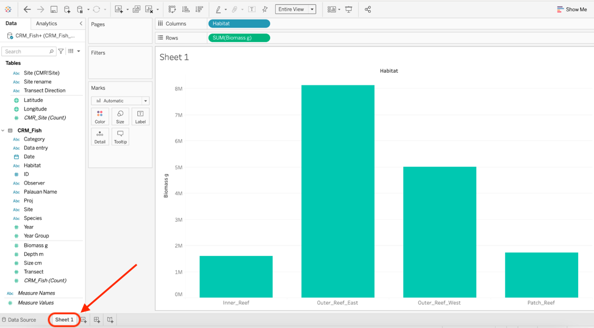
    - Create a new worksheet by clicking on the button directly to the right of “Bars”.
    
    - Name this sheet “Pie”.
    - In the new sheet, create exactly the same graph. Drag **Habitat** into **Columns** and **Biomass** into **Rows**. 
    - Go to **Show Me** and choose Pie Chart. 
        - The pie chart will look very small, so change the view to Entire View. Your current sheet should look like the image below:
        
    - Try using the **Size** function in the **Marks** menu. Notice that when you change the size of this graph, you are changing the size of the whole pie chart. 
- When you are changing something like the size, you have to experiment a bit to see what the software will do. Each graph type will respond differently to changing the size. 

4. Labels

<iframe width="560" height="315" src="https://www.youtube.com/embed/YXfZ2kcLdWA" title="YouTube video player" frameborder="0" allow="accelerometer; autoplay; clipboard-write; encrypted-media; gyroscope; picture-in-picture" allowfullscreen></iframe>

5. Details

    - We will cover the Details marks in a [later session](#tableau-dashboards-part-1-basic-dashboards). 

6. Tooltip
 
<iframe width="560" height="315" src="https://www.youtube.com/embed/tv4Ccex2m68" title="YouTube video player" frameborder="0" allow="accelerometer; autoplay; clipboard-write; encrypted-media; gyroscope; picture-in-picture" allowfullscreen></iframe>

### Line Plot

1. Practice Exercise: Create and modify a **Line Plot**
    - Create a new sheet and name it “Line”.
    - Drag **Year** into **Columns** and drag **Size** into **Rows**.
    - For a line plot, summing the size of all the fish doesn’t make much sense. In this case, showing the average size of the fish per year makes more sense, so let's do that. 
    - Right click on the field where it says **SUM (Size cm)** and a drop down menu will appear. Choose **Measure**, then click on **Average**.
    
    

    - Does your plot now look like the image below? If so, you can move on to the next steps.
    

### Area Plot

1. Good job! From here, it is easy to change your **Line** plot to an **Area** plot. Under the **Marks** menu, open the dropdown menu where it says **Automatic** and click on **Area**.
  

2. As you can see, there are many options in this dropdown menu. This is where you can manually change the type of plot displayed.  

### Map

1. There are two ways to create a map. 
2. First, on a new sheet you can drag and drop **Longitude** to **Columns** and **Latitude** to **Rows**. 
     - *Remember that Columns are the x-axis and Rows are the y-axis.*  
     - Your map should look like this: 
     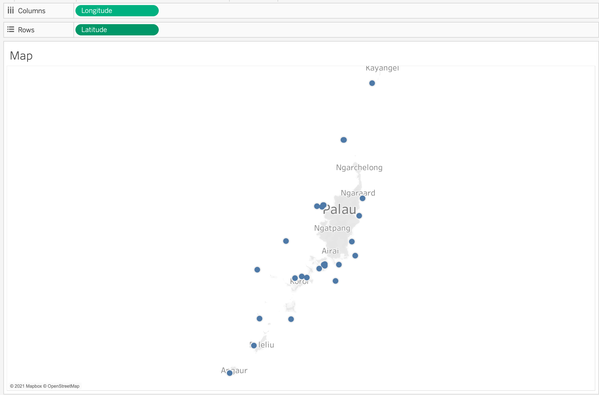

3. Next, clear the **Columns** and **Rows** fields. You can do this either by right-clicking and then choosing **Remove** or you can drag **Longitude** and **Latitude** back into the left column.

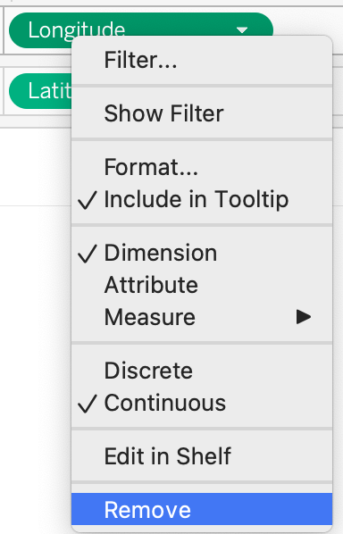

4. Second, there is an even easier way to plug in geographic spatial data. Double-click **Latitude** and then double-click **Longitude**. If you assigned the data properly (i.e. Dimension, Geographic Role: Latitude), Tableau will know exactly how to create this map for you.  
    - Your map should look exactly the same as the previous visualization:
    

5. Name this sheet “Map”
6. Customizing the Map using the **Marks** menu
    - Using the **Color** tool, change the color of the elements to a preferred color and add a black border. 
    - Using the **Size** tool, make the elements a bit larger so you can see them better.
      - Remember that sliding to the right makes the elements larger and to the left makes them smaller. 
    - Do you notice anything missing? If we were to show this map to a collaborator, they would only see the Longitude and Latitude, but not the Site name. Let’s add the **Site** name to the **Tooltip** as dynamic text (or text that will be updated as the user interacts with the visualization). 
      - Find **Site** in the left column under CRM_Fish.  Drag and drop **Site** into **Tooltip** in the Marks menu. 
    - Edit **Tooltip** to clarify the map for users.  
      - Click on **Tooltip** so we can edit the text. We want the name of the site to be at the top, so cut and paste “Site: <ATTR(Site)>” to move it above Latitude and Longitude. 
      - Delete the static text “Site:” leaving just “<ATTR(Site)>” at the top. 
      - Select all the text and change the alignment to center. 
      - Next, add “˚N” to the right of \<Latitude\> and “˚W” to the right of \<Longitude\>
        - Mac shortcut: “Option + Shift + 8”
        - Windows shortcut: “”Alt + 0176” (with Num Lock on)
        - If you have trouble with the degree symbol, copy and paste from this text: ˚N  ˚W
        
      - Click **OK** to close the editing window and hover your cursor over your map to check that the tooltip is working. 
      

7. You have just created an interactive map showing the various sites around Palau where data was collected. 
    - Take a moment to explore the functionality of the map you created by moving your cursor around the map and clicking on a few of the data points.

### Bubble Plot

1. To create a Bubble plot, you always start with a Bar plot. 
    - In a new sheet, drag and drop **Species** into **Columns** and **Biomass** into **Rows**.
    - Then, click on **Show Me** and choose **Bubble**.
    
    - E Voilá! A Bubble plot!
    
    - Name this sheet “Bubble.”

### Scatter Plot

1. Finally, let’s create a Scatter plot. Scatter plots are tricky; follow along with this video to learn about scatter plots in Tableau. 

<iframe width="560" height="315" src="https://www.youtube.com/embed/iKfEnj1RQJI" title="YouTube video player" frameborder="0" allow="accelerometer; autoplay; clipboard-write; encrypted-media; gyroscope; picture-in-picture" allowfullscreen></iframe>

### Editing and Formatting the Axes

1. “Biomass g” is not a very descriptive title for the x-axis. Let’s change it to give more information to a viewer. Double-click on the axis and an editing window will pop up.

2. Under Title delete “Biomass g” and type “Total biomass (g).”
3. Do the same for the y-axis. Replace the title with “Avg. Size (cm).” 
4. Now, we want to increase the font size to make the axes titles easier to read. 
    - Right-click on the y-axis and choose Format.
  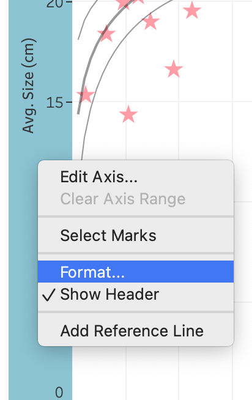

    - Open the dropdown menu that says Font: and change the font size to 14.
  
    
5. Do the same for the x-axis. 
6. When you are done, click on the X in the right corner of the Format window to exit. 

### Saving My Files

1. There are two primary ways to save your work in Tableau. The first is similar to saving any other type of file on your computer. 
    - Click on **File > Save As** on the menu bar at the top of your screen. Name this file “Tableau_class_skills_1”. Save the file under your Tableau Data Training folder.
    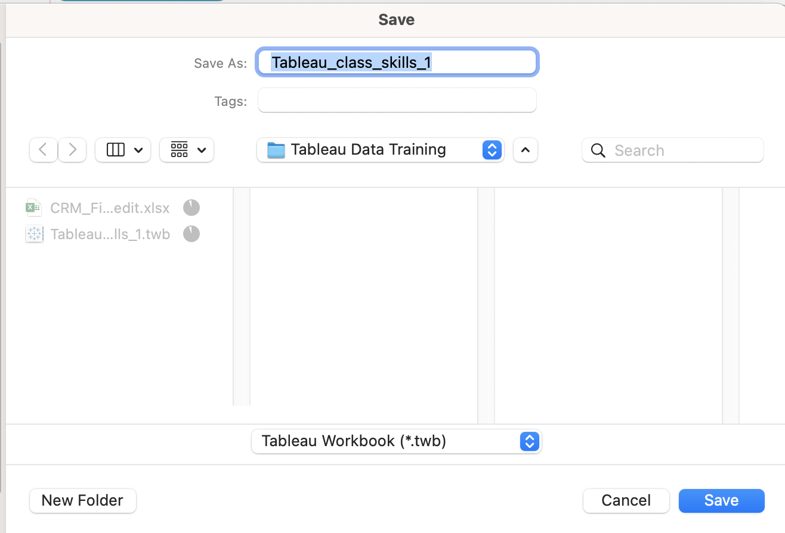
    - Let’s take a look at the files. If you look at the Tableau Data Training folder, you’ll see that the Excel file CRM_Fish is 2.1 megabytes while the Tableau Workbook (.twb) that you just saved is 226 kilobytes. That’s significantly smaller than the original Excel file because your Tableau Workbook file doesn’t contain the data, it just has the instructions for what to do with the data. Therefore if you save .twb files (Tableau Workbook file) and you want to share them with a colleague, you also have to share the original data file.

2. Packaged Workbooks
    - The second way to save a file saves a compressed version of both the data file and the Tableau Workbook. This is called a Packaged Workbook.
    - First, you have to create a data extract, which puts your data in Tableau format. On the menu bar at the top of your screen click on **Data > CRM_Fish > Extract Data**
    
    
    - Click extract, name this file CRM_Fish_Extract, and save it in your Tableau Data Training folder. 
    - Now that you have created your extract, you will create a packaged file. In order to do that, go to **File > Export Packaged Workbook > Save**
    - If you look at the folder in your finder, you will see that the new file type is **.twbx** which means it contains both the data and the instructions (Tableau Packaged Workbook file). 
    - If you want to share your work with colleagues who also have Tableau installed, you will share Packaged Workbooks (.twbx) with them. 

### Homework Exercise

1. Open data file  Excel file CRM_Fish in Tableau, check field dimensions vs measure, data types, discrete vs. continuous. 
1. Create a bar plot, a pie chart, line, map, scatter plot.
1. Make presentable for an audience. Ensure that: 
    - Axes are legible size and descriptive titles
    - Marks utilize nice and legible colors
    - Tooltips provide useful information
    - Name all worksheets
1. Create a packaged workbook (.twbx).
1. Check your work by comparing it with [this file](files/M3S2_exercise_key.twbx).

### Tableau Skill Part 1: Summary 
1. Congratulations! You are now equipped to create basic plots in Tableau and take full control of their design.
2. You also know that when sharing your work with colleagues, you should always include the data, either as a separate file, or included in your workbook as a data extract. 

## Tableau Skills Part 2: Multiple Factors and Dynamic Tables

***In this session ***

1. [Learning Objectives](#multiple-factors-and-dynamic-tables-learning-objectives)
1. [Value Statement](#multiple-factors-and-dynamic-tables-value-statement)
1. [Multiple Factor Plots Using the Marks Menu](#multiple-factor-plots-using-the-marks-menu)
   - Create a map with multiple factors
   - Create a bar plot with multiple factors
   - Create a timeseries with multiple factors
    - Create a scatter plot with multiple factors
    - Create a bar plot using continuous data
1. [Maps](#maps)
    - Practice exercise: Search and reset on a Map.
1. [Filters](#filters)
1. [Dynamic Tables](#dynamic-tables)
1. [Save Your Work](#save-your-work)
1. [Conclusions](#conclusions)
1. [Homework](#homework)

### Multiple Factors and Dynamic Tables: Learning Objectives

1. Learn how to create plots with multiple factors (e.g., colors, mark size, shapes).
1. Explore Tableau’s mapping functionalities and learn to customize them.
1. Understand Tableau’s powerful filtering capabilities.

### Multiple Factors and Dynamic Tables: Value Statement

1. In this session you will take your skills to the next level and gain full control of how your plots and maps look and how to use filters to display only the information that you are interested in. By adding multiple factors, you can communicate more information through color, size, and shapes. These are the building blocks that make a full interactive visualization!

### Multiple Factor Plots Using the Marks Menu
1. So far we have learned how to make simple plots, meaning that the plot has one dimension and one measure and you can modify the Marks. But what really makes Tableau awesome is that you can make interactive plots very quickly that look very appealing. Let's start with an example. 
1. Create a map with multiple factors
   - In a new sheet, drag **Longitude** into **Columns** and **Latitude** into **Rows**. Name the sheet “Map2”
      - Now, let’s change the size of the circles to represent the total biomass of that site. In order to make that change, drag and drop the **Biomass** into the **Size** in the Marks menu.
      - Result: 
     
     
    - Troubleshooting: What if I drag something into the wrong Mark? 
      - *Don’t worry, there are 2 easy solutions. First, you can drag the dimension or measure that shows at the bottom of the Mark menu into the correct Mark. Second, you can simply drag the item back into the left column to delete it from the Mark menu. *
    - Exploring the Legend
      - In the upper right corner of your Tableau, you should see a legend titled “SUM(Biomass g)”. If you can’t see it, minimize the Show Me menu. 
      - If you double-click the legend, you will be able to modify even more aspects of the size marks. Go ahead and play with the ranges to explore. 
    - Now, let’s say you want to change the color based on the habitat to show the different habitats at different sites on the map. In order to do that, drag and drop Habitat into the Color field of the Marks menu. 
     - Double-click the Habitat legend on the right to explore the many color palettes that Tableau offers. 
        - There are two methods for choosing colors. The first is to just click **Assign Palette** and Tableau will automatically change the color of each Data Item. The second is to change each color manually. Click on the Data Item, for example **Inner_Reef**, so it is highlighted and then click on the specific color you’d like to choose. 
1. Create a bar plot with multiple factors
    - In a new sheet, drag **Site** into **Columns** and **Biomass** into **Rows**. 
      - Name this sheet “Bars2” 
      - Sort the bars in descending order. There are two potential approaches:
        - 1) Right-click the **Site** item in the Rows field. Click sort and then choose descending and close the pop out menu. 
       - 2) At the top of Tableau, there is a shortcut menu with many symbols. An explanation of each function should show when you hover over the button. Click this one:
        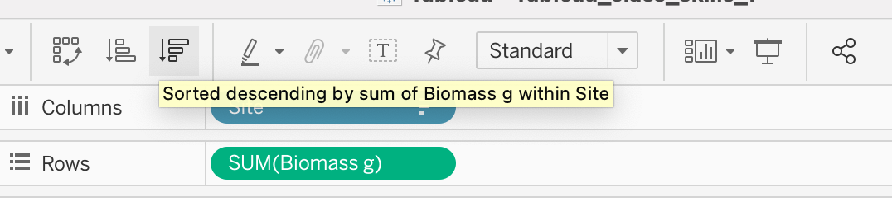
          - The arrow pointing down represents descending order. 
      - Drag **Habitat** into the **Color** mark. 
    - You can see that this is the same representation with a bit more detail for a viewer. 
   - What if we want to know how different species contribute to the overall biomass of each site?
     - Remove **Habitat** from the Marks menu by dragging it to the left column. 
    - This is a fun example of the many possible options you have by adding dimensions and measures into the Marks menu. 
1. Create a timeseries with multiple factors
<iframe width="560" height="315" src="https://www.youtube.com/embed/7KiCSWUZFp0" title="YouTube video player" frameborder="0" allow="accelerometer; autoplay; clipboard-write; encrypted-media; gyroscope; picture-in-picture" allowfullscreen></iframe>
1. Create a scatter plot with multiple factors
    - In a new sheet, drag **Biomass** into **Columns** and **Size** into **Rows**. Name this sheet “Scatter2”
      - Change the Size from Sum to Average by right-clicking **Size**, choose **Measure** and choose **Average**:
      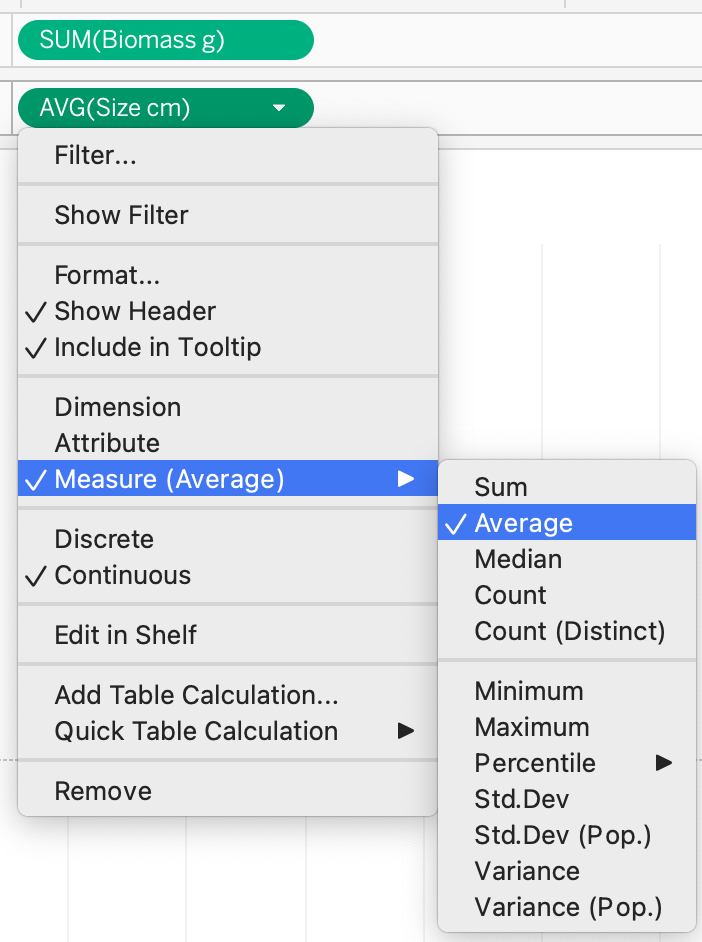
    - Then, drag **Site** into **Details** in the Marks menu. 
    - This plot still doesn’t give us much information. Let's add more information by changing the shapes of each point on the scatter plot to represent Habitat. Drag **Habitat** into **Shapes** in the Marks menu.
     - *Just as you did with Colors, you can double-click Shapes and explore  different shape palettes.  * 
    - Double-click **Shapes**. Open the drop-down menu under **Select Shape Palette**: and choose **Filled**. Then click **Assign Palette** and **OK**.
    - What if we want to add even more information? Let’s also make each Habitat a different color. To do that, drag a new Habitat field from the left sidebar into **Color** in the Marks menu. 
      - *Notice that you have two habitat fields in the Marks menu. *
    - Do you notice that there is blank space at the bottom of the plot from zero to twelve? We don’t really need that dead space so let’s get rid of it. 
      - Double-click on the **y-axis**. Uncheck **Include zero**. Exit the pop-up screen and you will see that now the plot is much clearer. 
1. Create a bar plot using continuous data
    - So far we have been using discrete data in the Marks menu to customize our plots. What happens when we use continuous data? Let’s find out together. 
    - In a new sheet, create a bar plot with **Species** on the x-axis and average **Size** on the y-axis. 
      - *Remember that you have to right-click the Size field in Rows to change it from sum to average. *
    - Then sort Species from highest to lowest Size. Right-click the **Species** field in Columns and choose **Sort**.  
    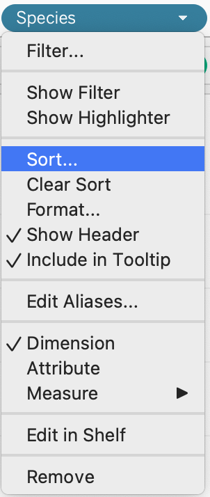
    - In the pop-up menu, open the drop-down menu under Sort By, choose **Field**, and choose **Descending** under Sort Order. 
    
      - When you close the pop-up menu, you should see this:
      
    - What if now we want to know which of these species had the highest observed biomass? One way to do that is to color code the bars by biomass. So drag **Biomass** to **Color** in the Marks menu. 
      - There’s a huge outlier. Do you see it? 
      
    - Notice that Tableau created a color scale. In previous plots that we made using color to represent discrete data, Tableau automatically created palettes with a set number of colors depending on the number of categories in the data. In this case, Biomass is continuous data so Tableau shows a spectrum of colors to represent the spectrum of continuous data. 
   - To change the color palette, double-click on the legend in the upper right corner and explore the palettes that Tableau provides. 
   - Right now, the outlier is making it difficult for us to see the difference between other colors. Let’s fix that. 
     - Double-click on the legend and go to **Advanced >>**. Check **End** and change the end field to **500,000**. Click **OK**. 
      
    - Here is the final result:
    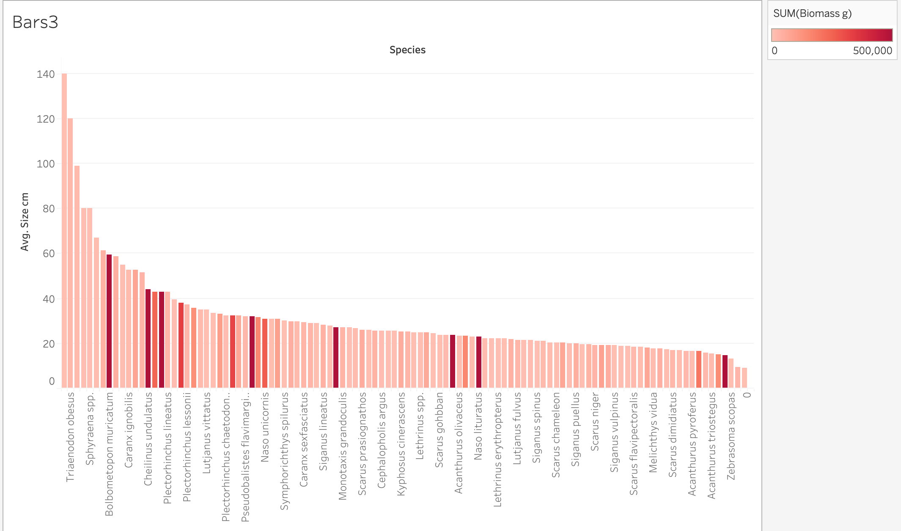

### Maps

1. Let’s explore the capabilities of maps. In a new sheet, double-click **Longitude** and **Latitude** to create a new map. Name this sheet “Map3”
   - Change the color of the points. In the Marks menu, click **Colors** and choose **orange**. 
   - On the bar at the very top of your screen, you will see that there is a whole menu for Maps. You can go to Background Maps and choose from an array of styles.
    
    - Open the Map Layers menu. Under **Maps**, click on **Map Layers…** and a new menu will appear on the left sidebar. 
      - Under Background choose **Style: Satellite**. 
      - Change **Washout** to **20%**.  
        - *You can either move the slider right or you can type in the white box.* 
      - *The information provided unter Data Layers only applies to the United States. *
    - The map will normally try to occupy the space and show the whole geographic scope of your data as a default. In this case, we see Palau from Kayangel to Angaur. 
    - To explore the whole globe by moving the map around, hover over the triange in the upper left corner and choose **Pan**.   
     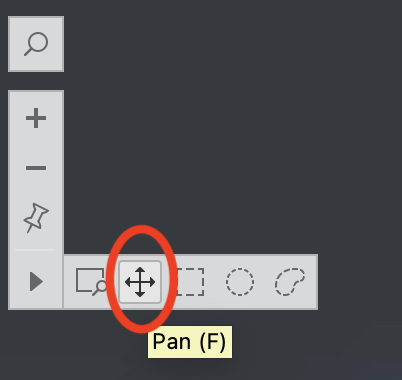
    - Then, you can click and drag to move the map. 
    - You can also choose the options to the right of Pan to use selection tools that allow you to choose a group of points to highlight. 
    - You can also zoom in and out using the plus and minus buttons. 

2. Practice exercise: Search and reset on a Map. 
    - If you click on the magnifying glass, you can type in different locations to search. For example, you can search for San Diego, California and the map will show you:
    
      - You can also search for the postal code of some countries. 
    - Now, your turn. **Search for your hometown**. How far can you **zoom in**?
    - Say we want to return to the original view. Click on the button that looks like a thumbtack to **Reset Map**. 

3. Another interesting feature of maps in Tableau is that you are not limited to coordinates. For example, your data set can include country names instead. 

<iframe width="560" height="315" src="https://www.youtube.com/embed/7cYNY4_bvLU" title="YouTube video player" frameborder="0" allow="accelerometer; autoplay; clipboard-write; encrypted-media; gyroscope; picture-in-picture" allowfullscreen></iframe>

### Filters

<iframe width="560" height="315" src="https://www.youtube.com/embed/FRa394sTYmI" title="YouTube video player" frameborder="0" allow="accelerometer; autoplay; clipboard-write; encrypted-media; gyroscope; picture-in-picture" allowfullscreen></iframe>

### Dynamic Tables

1. The last thing we are going to learn in this session is how to create and use tables. 
1. There are three conditions to keep in mind when you create a table in Tableau:
    - Data should be dragged into Rows because we are following a long format. 
      - Refer to [Module 2](#data-cleaning-best-practices) to learn more about long versus block format
    - Everything has to be discrete because the software will always attempt to plot continuous data as a chart, not as text. 
    - You can use filters, sort, and all the other functionalities that you learned for other types of plots. Tables in Tableau are similar to dynamic tables in Excel.      

<iframe width="560" height="315" src="https://www.youtube.com/embed/scRzDONC9GY" title="YouTube video player" frameborder="0" allow="accelerometer; autoplay; clipboard-write; encrypted-media; gyroscope; picture-in-picture" allowfullscreen></iframe>

### Save Your Work

### Conclusions

1. Congratulations! You have completed one of the most important sections of this training to be able to fully customize your visualizations in Tableau. By putting together all the pieces that you have learned so far, you are ready to dive into how to make interactive visualizations to share with others. Yet before that step, our next session will teach you how to create new calculated fields to enhance the insights that you can get from your data.

### Homework

1. Create a bar plot where x-axis is year, y-axis is total biomass, and color is habitat.
1. Create a map where size of bubbles represents avg size of fish and color of bubble represents total biomass.
1. Create a scatter plot where x-axis is total biomass, y-axis is avg size. Dots represent sites. Color and shape are the year.
1. Challenge: Pie chart where color represents habitat, size of slice represents total biomass, 1 pie chart in the same plot for each year 2012, 2013, 2014.
1. Create filters for species that allow you to select 1 species at a time in a single dropdown menu for any of these graphs.
   - Note: Make sure all axes, labels, tooltips are legible and look presentable for an audience. 
1. Create a packaged workbook (.twbx).
1. Check your work by comparing it with [this file](files/M3S3_exercise_key.twbx).

## Tableau Skills Part 3: Operations and Calculated Fields

***In this session*** 

1. [Learning Objectives](#operations-and-calculated-fields-learning-objectives)
1. [Value Statement](#operations-and-calculated-fields-value-statement)
1. [Convert Units Using Calculated Fields](#convert-units-using-calculated-fields)
1. [Manually Calculate Average](#manually-calculate-average)
1. [More Functions](#more-functions)
1. [Table Calculations: Percentage of Total and Running Total](#table-calculations-percentage-of-total-and-running-total)
1. [Conclusions](#operations-and-calculated-fields-conclusions)

### Operations and Calculated Fields: Learning Objectives

1. Learning the different ways to calculate custom fields in Tableau.
1. Using new calculations to extract new insights from data.

### Operations and Calculated Fields: Value Statement

1. In this session you will learn how to create new calculated fields in tableau, ranging from simple sums and averages, to more complex operations such as running totals and percentages.

### Convert Units Using Calculated Fields

1. So far we have mostly used measures to create plots by using SUM and AVERAGE. In certain situations, however, we might need to perform some operations by using one or more variables or calculate a new field. In the example below you will see how these calculated fields can be used to change a value from grams to tonnes.
<iframe width="560" height="315" src="https://www.youtube.com/embed/V_CysItY2CU" title="YouTube video player" frameborder="0" allow="accelerometer; autoplay; clipboard-write; encrypted-media; gyroscope; picture-in-picture" allowfullscreen></iframe>

### Manually Calculate Average

1. While Tableau provides an easy way to calculate the AVERAGE through using the right click functionalities on a field that is being used in an active chart, there are other ways to estimate it manually, and with more control over what the software is doing. The video below shows how to do this and how it compares to Tableau’s automatic method.
<iframe width="560" height="315" src="https://www.youtube.com/embed/tnAnwczQ3mk" title="YouTube video player" frameborder="0" allow="accelerometer; autoplay; clipboard-write; encrypted-media; gyroscope; picture-in-picture" allowfullscreen></iframe>

### More Functions

1. While we have covered the basics of how to create calculated fields, there is a lot more to explore.
1. Open a new **Calculated Field** and click on the small arrow on the right to expand the menu.
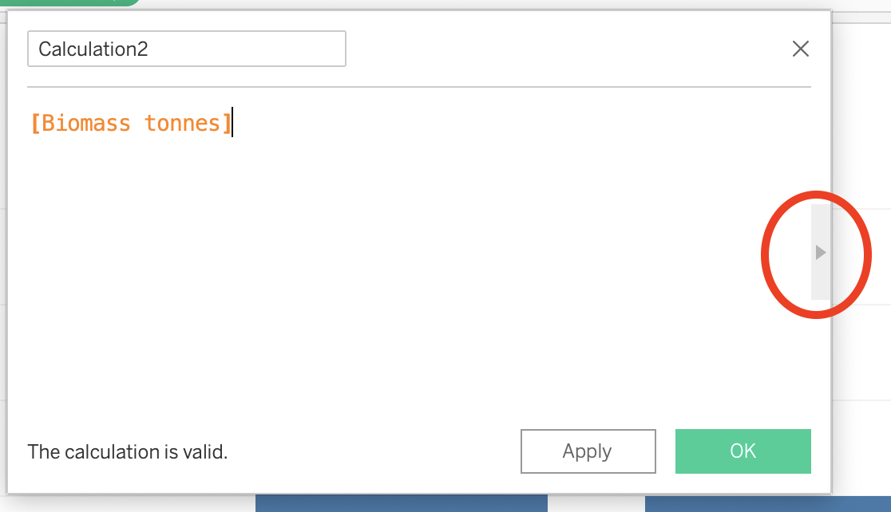

3. If you scroll through the list, you will see all the functions that Tableau is capable of performing. These functions are very similar to operations and columns in Excel. 
4. We recommend that you check out Tableau’s free online resources to learn more about calculated fields. 
    - [Tableau free training videos](https://www.tableau.com/learn/training/20212)
    - Or if you are looking for tips not provided by Tableau, make sure that you are searching for operations in SQL language. 
5. One common calculation in ecology is finding the average biomass at a site that has been sampled multiple times, such as by several divers each swimming transects. You can use a calculated field, yet the details of your sampling and data arrangement affect how you set it up. See an example of setting up a calculated field in the sample data set below.

<iframe width="700" height="532" src="files/M3S4_calculated_field_biomass_example.pdf" frameborder="0" allowfullscreen></iframe>

### Table Calculations: Percentage of Total and Running Total

1. One additional way to perform custom calculations is by using Table calculations, which are affected explicitly by whatever is being displayed in the active chart.
1. In order to understand these better, let's do an example. Create a new pie chart.
    - Create a new sheet and name it “Pie4.”
    - Drag **Habitat** into **Columns** and **Biomass tonnes** into **Rows**.
      - *A bar chart will appear *.
    - Open the **Show Me** menu and choose **pie charts**. 
    - Change the view to Entire View.
    - Activate labels by clicking on **Label** in the Marks menu and check **Show mark labels** and change the font size to 14pt.
    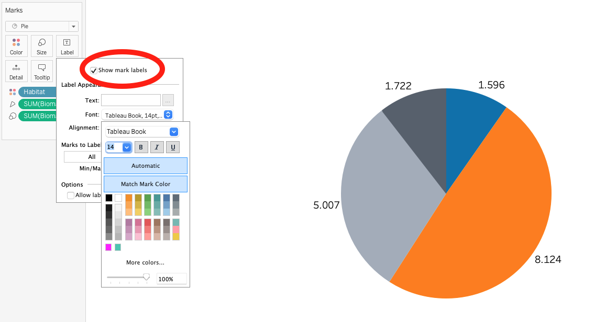
1. Next, follow along as Alfredo shows you how to calculate percentages of total and display them in the label.    
<iframe width="560" height="315" src="https://www.youtube.com/embed/yjssVupYXrs" title="YouTube video player" frameborder="0" allow="accelerometer; autoplay; clipboard-write; encrypted-media; gyroscope; picture-in-picture" allowfullscreen></iframe>
1. Just like with Calculated Fields, Table Calculations are a powerful tool in Tableau’s repository. If you want to explore more resources, go to:
    - [https://help.tableau.com/current/pro/desktop/en-us/calculations_tablecalculations.htm](https://help.tableau.com/current/pro/desktop/en-us/calculations_tablecalculations.htm) 

### Operations and Calculated Fields: Conclusions

1. Great work! You have completed the section on how to create your own calculations and use them to enhance your understanding of the data through visualizations. You are now ready to put all of these elements together and dive right into the creation of dashboards.

## Tableau Dashboards Part 1: Basic Dashboards

***In this session*** 

1. [Learning Objectives](#basic-dashboards-learning-objectives)
1. [Value Statement](#basic-dashboards-value-statement)
1. [Introduction to Dashboards](#introduction-to-dashboards)
1. [Floating Dashboards](#floating-dashboards)
1. [Actions: Filter and Highlight](#actions-filter-and-highlight)
1. [Conclusions](#basic-dashboards-conclusions)
1. [Homework](#basic-dashboards-homework)

### Basic Dashboards: Learning Objectives

1. Learn the basic windows and menus to create dashboards.
1. Explore how to make different charts interact with each other through dashboard actions.

### Basic Dashboards: Value Statement

1. In this session, you will jump from creating individual charts, to creating dashboards where you can combine multiple charts and make them interact with each other.
1. You will also learn the basics for how to make your visualizations more visually appealing through the customization of colors, positions, legends, and other visual elements.

### Introduction to Dashboards

1. The very first thing to learn about dashboards is how to add different elements to it. Not everything is about the interactive charts, but also the text, symbols and other elements that help you convey a story for the reader. In the video below, you will learn how to set up your canvas and add elements to it.  
<iframe width="560" height="315" src="https://www.youtube.com/embed/pP78GuC_7_s" title="YouTube video player" frameborder="0" allow="accelerometer; autoplay; clipboard-write; encrypted-media; gyroscope; picture-in-picture" allowfullscreen></iframe>

### Floating Dashboards

1. Another important skill to master is the correct positioning of the elements in a dashboard. While Tableau tries to help with a tiled arrangement (as in the video above), it is important that you know how to gain full control of the exact size and position of each item that you add. The video below will help you get familiar with these important skills.
<iframe width="560" height="315" src="https://www.youtube.com/embed/C96zusYc3vE" title="YouTube video player" frameborder="0" allow="accelerometer; autoplay; clipboard-write; encrypted-media; gyroscope; picture-in-picture" allowfullscreen></iframe>
2. Remember that when working with graphic designers, managing sizes and positions is extremely important. Make sure to practice these skills.

### Actions: Filter and Highlight

1. Once you have added various elements, and charts, to your dashboards, it is time to make them interact with each other. The video below will show you two methods (filtering and highlighting) to use one chart to control the items in another chart. We will also cover some common troubleshooting situations.
<iframe width="560" height="315" src="https://www.youtube.com/embed/tYmT9A1wZUY" title="YouTube video player" frameborder="0" allow="accelerometer; autoplay; clipboard-write; encrypted-media; gyroscope; picture-in-picture" allowfullscreen></iframe>

### Basics Dashboards: Conclusions

1. Congratulations! You have completed the most important step in moving from single charts, to fully interactive data visualizations. The next step is to enhance these visuals a little more by learning how to incorporate graphic design elements.

### Basic Dashboards: Homework 

1. Create a map. 
    - Remember that you know how to change the background and edit colors of the dots. 
1. Create a scatter plot where the x-axis is average size, y-axis is total biomass and each mark within the scatterplot is a different species. 
1. Now, create a dashboard with the map and the scatterplot. Create a filter so that when you click on the map it filters the scatterplot.
    - Remember to include title and text that describes the purpose of the dashboard. 
    - Feel free to create a canvas size that fits your taste. If you want a place to start, try 1000x800 (WxH).
    - Pay special attention to the positioning of your elements by using the 'layout' menu. Look at the answer key to see the exact positioning that the instructor used.
    - Remember that you can also change the font size and color of any item in the dashboard (including the color legend) by clicking on the particular element and selecing 'format'.
    - If you have trouble making the filter work, use the answer key to open up the available action in the Dashboard/Actions menu. Make sure you understand everything that is going on within the action.
    - Finally, remember that you can right click on the titles of each chart and hide them. This might be helpful to streamline the number of titles in the dashboard.
1. Try a few adjustments to practice getting the aesthetic feel just the way you want.

## Tableau Dashboards Part 2: Graphic Design Elements

***In this session ***

1. [Learning Objectives](#graphic-design-learning-objectives)
1. [Value Statement](#graphic-design-value-statement)
1. [Recap: Tooltip Customization and Exact Colors](#recap-tooltip-customization-and-exact-colors)
1. [Background Images](#background-images)
1. [Custom Shapes](#custom-shapes)
1. [Filters in Dashboards](#filters-in-dashboards)
1. [Dynamic Text Elements](#dynamic-text-elements)
1. [Creating a Template](#creating-a-template)
1. [Conclusions](#graphic-design-conclusions)

### Graphic Design: Learning Objectives

1. Learn how to add custom graphic design elements to your visualizations.
1. Learn how to add custom shapes to your plots.
1. Learn how to use text interactively.
1. Create your own template for amazing-looking visualizations.

### Graphic Design: Value Statement

1. You already have the tools to create visualizations and communicate your data. Let’s take it to the next level by adding custom shapes, images, and other graphic design elements!

### Recap: Tooltip Customization and Exact Colors

1. Before we get started, let’s remind ourselves of the importance of using good tooltips and the perfect colors. When working with graphic designers, ask them for the specific color code, so that you can reproduce their vision accurately.
<iframe width="560" height="315" src="https://www.youtube.com/embed/jcuoPNreWJE" title="YouTube video player" frameborder="0" allow="accelerometer; autoplay; clipboard-write; encrypted-media; gyroscope; picture-in-picture" allowfullscreen></iframe>

### Background Images

1. When creating dashboards, tableau usually prefers solid colors. However, you can add your own images to make it more lively. Remember to use PNGs with transparent backgrounds whenever possible. The video below shows how to do so.
<iframe width="560" height="315" src="https://www.youtube.com/embed/iKzcIJDWgvA" title="YouTube video player" frameborder="0" allow="accelerometer; autoplay; clipboard-write; encrypted-media; gyroscope; picture-in-picture" allowfullscreen></iframe>

### Custom Shapes

1. Wouldn’t it be cool if you could have a little image of each fish species in your database show up on top of their respective bar plot or instead of the little circles in a scatter plot? This is your lucky day, that is exactly what the video below will show you how to do.

1. Before you begin this section, download [this folder of images](https://github.com/NCEAS/data-training-picrc-cos/raw/main/images/TNC%20-%20Fish%20Images.zip) and save it to your desktop folder “Tableau Data Training.” 
<iframe width="560" height="315" src="https://www.youtube.com/embed/joS9x6kKbiI" title="YouTube video player" frameborder="0" allow="accelerometer; autoplay; clipboard-write; encrypted-media; gyroscope; picture-in-picture" allowfullscreen></iframe>

3. Alfredo’s tips for custom shapes:
    - *Save the files as .png with transparent background*.
    - *Save all the .png images in one folder*.

### Filters in Dashboards

1. So far, we have focused on using sheets to filter each other when together in a dashboard. However, sometimes we might want to use a field (not a sheet) to filter the information in the whole dashboard. 

1. Below, you will find an example of how to do this.
<iframe width="560" height="315" src="https://www.youtube.com/embed/QnUH-GObfgA" title="YouTube video player" frameborder="0" allow="accelerometer; autoplay; clipboard-write; encrypted-media; gyroscope; picture-in-picture" allowfullscreen></iframe>

### Dynamic Text Elements

1. Another important aspect of using interactive elements in Tableau is that we not only have the possibility to filter charts, but also tables. Remember, Tableau is a table manager in the end. While this might not seem too helpful, the video below will show you how powerful this concept can be. 
<iframe width="560" height="315" src="https://www.youtube.com/embed/6ZmctDlHTPc" title="YouTube video player" frameborder="0" allow="accelerometer; autoplay; clipboard-write; encrypted-media; gyroscope; picture-in-picture" allowfullscreen></iframe>

### Creating a Template

1. We strongly recommend that you develop a template with a graphic designer when possible before you create dashboards. This is the best way to enhance the quality of your dashboards. See [Module 4 Session 3](#working-with-graphic-designers) for tips on working with a graphic designer. 

### Graphic Design: Conclusions

1. Congratulations! You have completed all of the technical Tableau skill sessions of this training. You have come a long way, and while you may not realize it yet, you are ready to create some of those amazing dashboards that you have seen published on the web or that we saw in our introductory session to Tableau. The video below will help you notice how simple elements can add up to amazing visualizations.  
<iframe width="560" height="315" src="https://www.youtube.com/embed/pzccZH0HUIw" title="YouTube video player" frameborder="0" allow="accelerometer; autoplay; clipboard-write; encrypted-media; gyroscope; picture-in-picture" allowfullscreen></iframe>

2. Check out https://public.tableau.com/app/profile/datamares to explore a wide range of dashboards that you can create using Tableau.

## Publishing to the web from Tableau

***In this session ***

1. [Learning Objectives](#Publishing-to-the-web-learning-objectives)
1. [Value Statement](#Publishing-to-the-web-value-statement)
1. [Saving Your Work and Your Datasets](#saving-your-work-and-your-datasets)
1. [Sharing Your Work](#sharing-your-work)
1. [Embedding into a Website](#embedding-into-a-website)
1. [Summary](#publishing-to-the-web-summary)

### Publishing to the Web: Learning Objectives

1. Learn how to share your content with colleagues.
1. Publish your work online.
1. Embed your dashboards in your website.

### Publishing to the Web: Value Statement

1. Tableau is a powerful tool to visualize and analyze data, however, its real value comes from being able to share this information with colleagues and the general public through the many options available.

### Saving Your Work and Your Datasets

1. As we learned in Session 2, there are two primary ways to save your work in Tableau. The first is similar to saving any other type of file on your computer. 
    - Click on **File > Save As** on the menu bar at the top of your screen. Name this file “Tableau_class_skills_1”. Save the file under your Tableau Data Training folder.
    
    
    
    - Let’s take a look at the files. If you look at the Tableau Data Training folder, you’ll see that the Excel file CRM_Fish is 2.1 megabytes while the Tableau Workbook (.twb) that you just saved is 226 kilobytes. That’s significantly smaller than the original Excel file because your Tableau Workbook file doesn’t contain the data, it just has the instructions for what to do with the data. Therefore if you save **.twb** files (Tableau Workbook file) and you want to share them with a colleague, you also have to share the original data file.

2. Packaged Workbooks
    - The second way to save a file saves a compressed version of both the data file and the Tableau Workbook. This is called a Packaged Workbook.
    - First, you have to create a data extract, which puts your data in Tableau format. On the menu bar at the top of your screen click on **Data > CRM_Fish > Extract Data**
    
    
    - Click extract, name this file CRM_Fish_Extract, and save it in your Tableau Data Training folder. 
    - Now that you have created your extract, you will create a packaged file. In order to do that, go to **File > Export Packaged Workbook > Save**
    - If you look at the folder in your finder, you will see that the new file type is **.twbx** which means it contains both the data and the instructions (Tableau Packaged Workbook file). 
    - If you want to share your work with colleagues who also have Tableau installed, you will share Packaged Workbooks (.twbx) with them. 
    - Remember that packaged workbooks will not be automatically updated when your datasets get more information. In order to do this, you will need to reconnect your file to have a “live connection” to your data source. To do this, go to **Data > CRM_Fish > Data Source** and select **Live** in the upper right corner. If the software cannot automatically locate the file, it will ask you to manually select it. Once you have selected the file and verified that your new data records are reflected in the visualization, go ahead and create a new data extract and packaged workbook with the updated information.

### Sharing Your Work

1. Exporting images
    - One way to share your results is through presentations and printed reports. In these cases, you cannot use the interactive dashboard, but instead use fixed images. Once you are happy with your dashboard or worksheet’s design, you can export it as an image. To export an image, click on **Worksheet or Dashboard -> Export image**. A menu will pop-up that will allow you to select the output format and directory.

2. Publishing workbooks online
    - Another way to share results is by saving your workbook and sharing it directly with another Tableau user. The limitation is that you can only share workbooks with people who have Tableau installed on their computers. Another solution is to publish it to a server and send the link to anyone you would like to look at the results. There are two kinds of services that Tableau provides to share information online: through a Public server (Tableau Public) or through a Private server (Tableau Server).
    - To publish to Tableau Public, click on **Server -> Tableau Public -> Save to Tableau Public**. This will pop-up a menu that allows you to login to your Tableau Public profile (create a free user in case you don’t have one yet), write the name of the workbook and add a description.
    - To publish to a Private server (Tableau Server), click on **Server -> Publish Workbook**. This will pop-up a menu that allows you to log in to your Tableau Server profile (your institution should provide you with a username and password), select the project inside your server, write the name for the workbook and add a description.
    - To find the hyperlink that can be shared with colleagues, go to your public tableau profile, navigate to the visualization of interest and click on **Share** in the lower right corner of the visualization. Copy and paste the provided link and share it with colleagues!
    

### Embedding into a Website 

1. Using the embed code
    - From the same **Share** menu where you would get the link to share with colleagues, there is another option to get an **Embed Code**. This code is useful when you are trying to incorporate your visualization directly into your website. For example, if you are using an html-based website, the only thing you need to do is to copy and paste this embed code into your html code, and the interactive visualization will display in your website. (Note: WordPress is an html platform, thus you could add a new section with the Tableau Embed Code).
    - Remember that when creating the dashboard, you selected a size for your canvas. This size will determine the size of the embedded visualization, so make sure to be in constant communication with your website manager to know the ideal width and height of your visualizations. 

### Publishing to the Web: Summary

1. After completing this session you are equipped to save your datasets in Tableau format, your workbooks, and share them with colleagues who have Tableau either with .twb or .twbx files.
1. You are also ready to publish your visualizations to different services online, either through a public website or a private server. Remember to create your Tableau Public account to get access to these services. While not covered in this session, we encourage you to explore the different settings available, including how to set some of your visualizations as private even though published in the public service.
1. Finally, you are ready to make these visualizations part of your own website! Remember to be in constant communication with your website manager to make sure that you follow the right format.

