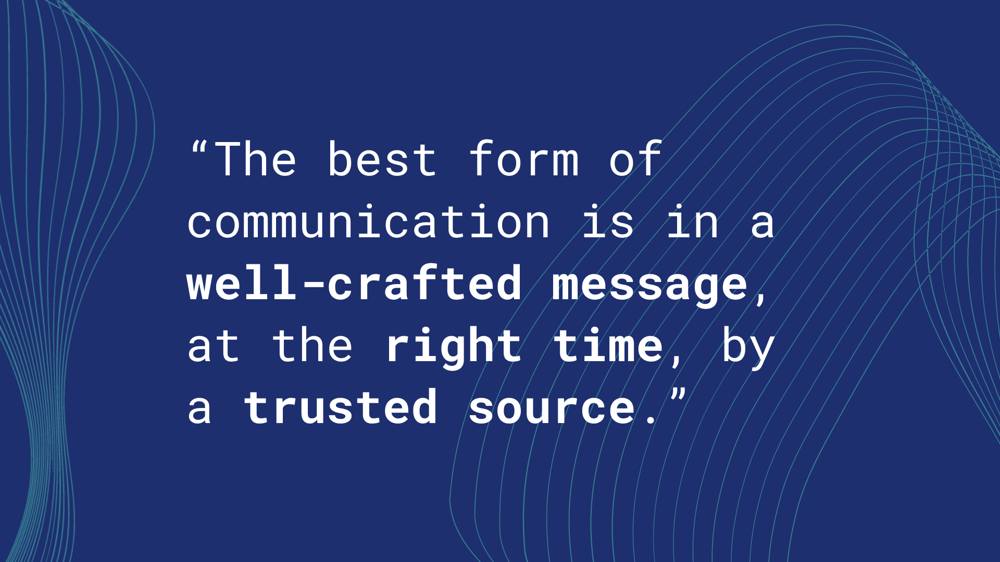
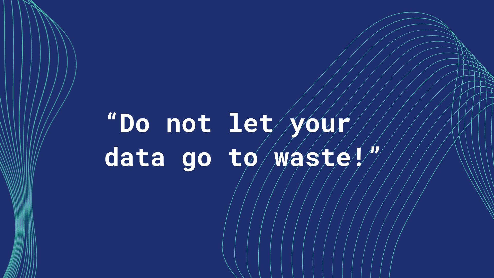
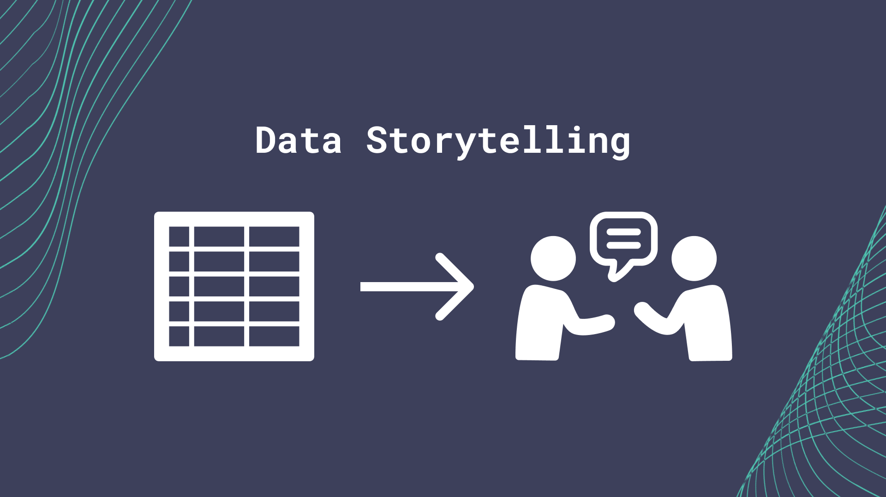
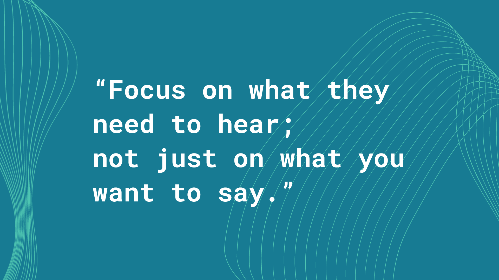
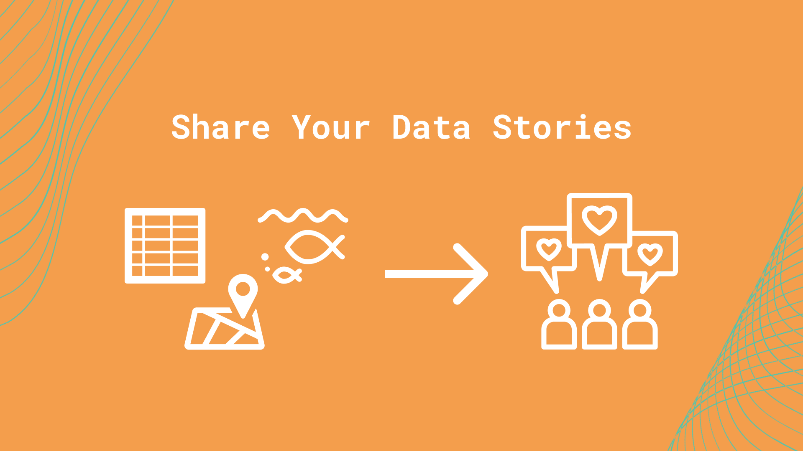
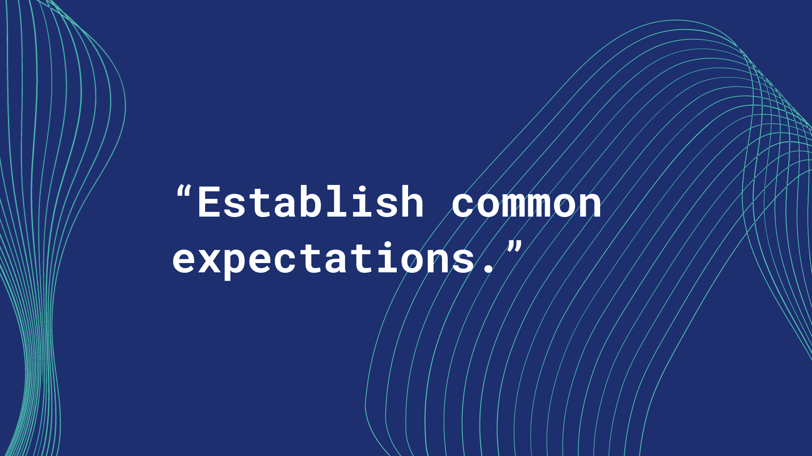
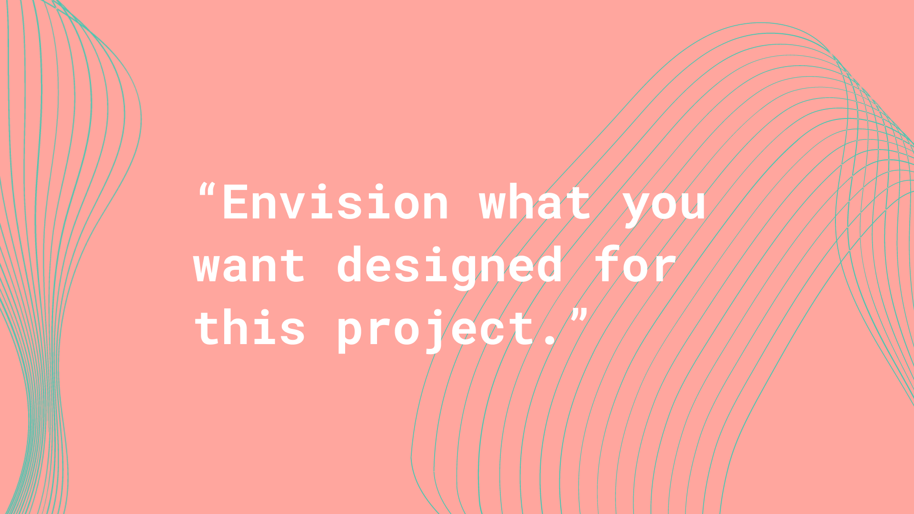
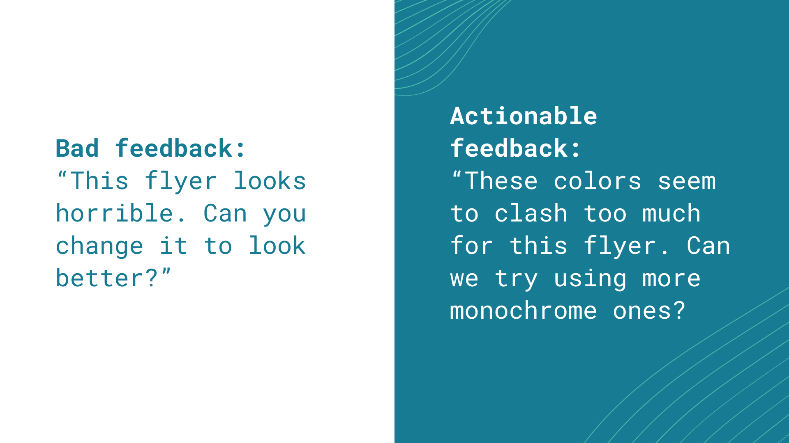
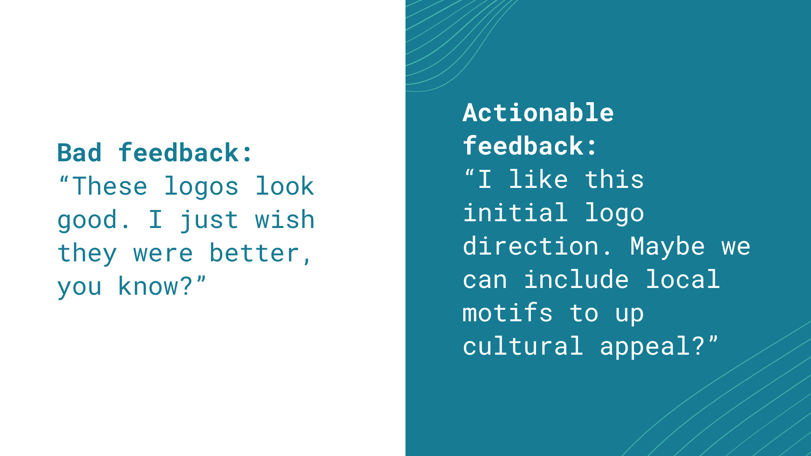

# Storytelling
## Communication Principles

***In this Session***

1. [Learning Objectives](#communication-learning-objectives)
2. [Prioritizing Engagement](#prioritizing-engagement)
3. [Salience, Credibility and Legitimacy](#salience-credibility-and-legitimacy-cornerstones-of-effective-communication)
4. [Crafting your Message](#crafting-your-message)
5. [The Message Box](#the-message-box)
6. [Practice Exercise: Fill Out The Message Box](#practice-exercise-fill-out-the-message-box) 
7. [Resources](#communication-resources)

### Communication: Learning Objectives

These three storytelling sessions are additional resources intended for communication professionals or those interested in expanding their skill sets beyond data management and visualization. The learning objectives are:
1. Approach science communication from an engagement framework.
2. Utilize tools like the "Message Box" for developing and crafting your message (practice exercise).

### Prioritizing Engagement

1. Science communication is more than simply providing information to your audience. Rather, a successful communication approach will include learning what your audience desires and needs as well as building a relationship with the community you are trying to reach in order to anticipate future interests.

2. In this module we present an engagement model of communication. In a deficit model of communication, information flows one way. The scientist presents new information to an audience. On the other hand, an engagement model relies on including members of your audience as active collaborators in knowledge-building. Successful engagement means building trust and long-term relationships with the audience you hope to reach.

Source: Twitter @TheComNetwork

### Salience, Credibility and Legitimacy: Cornerstones of Effective Communication

1. A guiding principle in effective communication to inform decision making is to consider the perceived salience, credibility, and legitimacy of the information from your audience’s perspective ([Cash et. al. 2002](https://dash.harvard.edu/bitstream/handle/1/32067415/Salience_credibility.pdf?sequence=4)). Another way to think of these terms could be the “when,” “who,” and “how” of the information provided.
    - Salience: “... the relevance of information for an actor’s decisions.” 
        - Ensure that the content you are providing is relevant to the decisions that your audience members encounter in a time frame that meets their needs. For example, there is limited value in informing a tourist who traveled to a beach that the water quality was unhealthy a week after they visited. Rather, aim to anticipate the needs of your audience members such that you can provide digestible information right when they need it.
    - Credibility: “...whether an actor perceives information as scientifically plausible and technically adequate.” 
       - The reputation of an organization or individual is of paramount importance when providing actionable information. Ensuring that “honest brokers of unbiased information” are the leading communicators enhances the perceived credibility of the information. This “credibility” consideration extends to every member of an organization or collaborative working group involved. Furthermore, after a period of time, audience members may desire to reflect on the accuracy of previous statements to gain an understanding of “how often have those providing the information been right?” 
     - Legitimacy: “...whether an actor perceives the process in a system as unbiased as well as politically and procedurally fair.” 
       - In many cases, audience members strongly consider how the information was collected, analyzed and conveyed - as well as the process for engaging communities that are most closely tied to the content. This requires transparency in the process and ensuring that perspectives of impacted stakeholders are integrated into the overall message.

### Crafting your message

1. In order to create messages that stick, brainstorm your call to action and draft your core message.
    - Messages are intended to **lead your audience to action.**
      - _Key term: _**Call to Action (CTA)**
      - What is the action you want to motivate people to do?

    - Draft before you write.

> "Consider and articulate what your story is really about. Not the noun, the verb. It's not enough to say your story is about, say, salmon. Is it a story about bears that eat salmon? Salmon that eat bears?" - Michelle Nijhuis in The Science Writers' Handbook: Everything You Need to Know to Pitch, Publish, and Prosper in the Digital Age (2013)

2. ***Good messages ...***
  
    - Invite your audience into conversation
  
      - Avoid jargon.
       - Instead, use descriptive language that your audience would be familiar with.
       - When you can’t find a perfect synonym for a jargon term, define the term or provide an analogy to something they are familiar with. 
       - Consider these examples of “jargony” terms and their “audience-friendly” counterparts:
          - Anthropogenic → human-caused
          - Ecosystem services → benefits from nature
          - Harmful algal blooms → outbreak of toxic algae
          - Submerged aquatic vegetation → underwater grasses
       - We want to make our messages accessible by leveraging our audience’s existing knowledge and framing the language to be socially and culturally relevant. Note that this approach is distinct from simply “dumbing down” the content.
  
    
    - Share more details about yourself to connect to the audience's values, interests, and concerns.
      - By sharing details about yourself and your background you can build trust with your audience and relate to them on a deeper level. Personal stories and connections can aid in establishing credibility and an attachment to the issue.
 
    
    - Help people see themselves in your story. 
      - Find compelling hooks. A hook is the first part of a story that pulls people in. It conveys the significance and entices readers to keep reading. 
        - For example: Why is it important now? What makes this story timely?
        - Can I tell this message through a story? People gravitate to stories and narrative structures. A good story captivates an audience's attention and makes the message memorable.

  
### The Message Box

1. In preparing to communicate your scientific information, consider the use of targeted tools or practices to best focus your messages. One of the most popular tools in the science communication field is the Message Box - developed and shared by [COMPASS](https://www.compassscicomm.org/about-us/).

2. The [Message Box](https://www.compassscicomm.org/leadership-development/the-message-box/) is a tool that helps researchers take the information they hold about their research and communicate it in a way that resonates with the chosen audience. It can be used to help prepare for interviews with journalists or employers, plan for a presentation, outline a paper or lecture, prepare a grant proposal, or clearly, and with relevance, communicate your work to others. While the message box _can_ be used in all these ways, you must first identify the audience for your communication as that will drive your messaging. You would have a very different delivery for a group of scientists compared to a group of school children even with the same core message.

The Message Box comprises five sections to help you sort and distill your knowledge in a way that will resonate with your (chosen) audience. How we communicate with other scientists (through scholarly publications) is not how the rest of the world typically communicates.

 
In a scientific paper, we establish credibility in the introduction and methods, provide detailed data and results, and then share the significance of our work in the discussion and conclusions. But the rest of the world leads with the impact, the take-home message. A quick glance of newspaper headlines demonstrates this. 

 
The five sections of the Message Box are provided below. For a detailed explanation of the sections and guidance on how to use the Message Box, work through the [Message Box Workbook](https://www.compassscicomm.org/wp-content/uploads/2020/05/The-Message-Box-Workbook.pdf).

3. Message Box Sections
 
**The Issue**

  - The "Issue" section in the center of the box identifies and describes the overarching issue or topic that you're addressing in broad terms. It's the big-picture context of your work. This should be very concise and clear; no more than a short phrase. You might find you revisit the issue after you've filled out your Message Box to see if your thinking on the overarching topic has changed since you started.
  
**The Problem**

  - The "Problem" is the chunk of the broader issue that you're addressing in your area of expertise. It's your piece of the pie, reflecting your work and expert knowledge. Think about your research questions and which aspect of the specific problem you're addressing would matter to your audience. The Problem is also where you set up the "So What" and describe the situation you see and want to address.
  
**The So What**

  - The crux of the Message Box, and the critical question the COMPASS team seeks to help scientists answer, is "So what?" Why should your audience care? What about your research or work is important for them to know? Why are you talking to them about it? The answer to this question may change from audience to audience, and you'll want to be able to adjust based on their interests and needs.
  
  - We like to use the analogy of putting a message through a prism that clarifies the importance to different audiences. Each audience will be interested in different facets of your work, and you want your message to reflect their interests and accommodate their needs. The prism below includes a spectrum of audiences you might want to reach, and some of the questions they might have about your work.
  
 
 
 **The Solution**

  - The Solution section outlines the options for solving the problem you identified. When presenting possible solutions, consider whether they are something your audience can influence or act upon. And remind yourself of your communication goals: Why are you communicating with this audience? What do you want to accomplish?
  
**The Benefit**

  - In the Benefit section, you list the benefits of addressing the Problem — all the good things that could happen if your Solution section is implemented. This ties into the So What of why your audience cares, but focuses on the positive results of taking action (the "So What?" may be a negative thing — for example, inaction could lead to consequences that your audience cares about). If possible, it can be helpful to be specific here — concrete examples are more compelling than abstract. Who is likely to benefit, and where, and when?
  
 - In addition to the [Message Box Workbook](https://www.compassscicomm.org/wp-content/uploads/2020/05/The-Message-Box-Workbook.pdf), COMPASS provides resources on how to [increase the impact](https://www.compassscicomm.org/practice/) of your message (include important statistics, draw comparisons, reduce jargon, use examples), exercises for practicing and [refining](https://www.compassscicomm.org/compare/) your message and published [examples](https://www.compassscicomm.org/examples/).

### Practice Exercise: Fill Out The Message Box

1. For your own practice, fill out a sample Message Box with an example audience from your own work (e.g. a local school, government agency, or even internal leadership). You can [download a blank message box](files/Message-Box-Blank.pdf) or draft your own.

    - Fill in your audience at the top of the Message Box.
    - Fill out the Message Box's 5 sections: "Issue", "Problems", "So What?", "Solutions", and "Benefits".
    - Practice providing your talking points for your latest project with a colleague.

### Communication Resources

1. If you'd like to learn more, watch [DataONE Webinar: Communication Strategies to Increase Your Impact](https://vimeo.com/323261612) from [DataONE](https://vimeo.com/dataoneorg) on [Vimeo](https://vimeo.com/).

<iframe src="https://player.vimeo.com/video/323261612?badge=0&amp;autopause=0&amp;player_id=0&amp;app_id=58479&amp;h=2dc6b6a91a" frameborder="0" allow="autoplay; fullscreen; picture-in-picture" allowfullscreen style="position:absolute;top:0;left:0;width:100%;height:100%;" title="DataONE Webinar: Communication Strategies to Increase Your Impact"></iframe>

## Data Storytelling

***In This Session***

1. [Learning Objectives](#storytelling-learning-objectives)
2. [Value Statement](#storytelling-value-statement)
3. [New Terms](#new-terms)
4. [Receive Your Data](#receive-your-data)
5. [Identifying Your Audience](#identify-your-audience)
6. [Understand Key Insights](#understand-key-insights)
7. [Connect Stories to Key Insights](#connect-stories-to-key-insights)
8. [Utilize Engaging Visuals](#utilize-engaging-visuals)
9. [Share Your Data Stories](#share-your-data-stories)
10. [Summary](#data-storytelling-summary)

### Storytelling: Learning Objectives
1. To learn the importance and potential of data storytelling.
   - ***Data storytelling:** The process of translating data sets into stories, or messages that your target audience can understand.*
2. To learn a sample of approaches to data storytelling, including connecting stories and visuals to data for maximum effectiveness.

### Storytelling: Value Statement

1. Do not let your data go to waste! Learning how to effectively share engaging stories from data will allow your data, research, and synthesis to reach an increased range of audiences.
1. Not everyone knows how to derive key insights and stories from your data, so increasing your data storytelling capacity will allow you to increase understanding and engagement from both internal and external organizational partners.

### New Terms
1. ***Data storytelling:*** The process of translating data sets into stories, or messages that your target audience can understand. 

### Receive Your Data
1. The first step in effective data storytelling is to ensure you are working with clean, standardized data:
   - This section assumes that the data you have to tell stories from are clean and standardized already. If your data are still raw and not cleaned, please refer to *Module 2* in this training curriculum, titled *“Working with Data”* to learn more about how to clean and standardize your data set.

### Identify Your Audience 

1. Knowing your audience is one of the primary steps in effective communication.
2. Crafting good messages is about building connections. The science you are representing will be more accessible to the communities who need it if messaging is customized for each audience.  
3. Take time to think about who your audience is for this project:
   - Is this for local school kids, or for large international agencies?
   - What are your audience's needs or goals? 
   - How can members of your audience help co-create these materials?
4. To help facilitate your thought process on who your audience is, we have included a handout and self-guided practice exercise below for you to use as a tool:
    - [***"Identify Your Audience" Handout + Exercise***](files/M4S2_Data_Storytelling_Audience_Handout_Exercise.pdf)
5. What considerations are most relevant as we create these data stories? Drafting a short list of these considerations can be a helpful starting point when initiating a data visualization process.

### Understand Key Insights
1. After receiving your clean, standardized data, and identifying your audience, reserve time to review your data to discover key data insights that would be highly relevant to your audience:
   - *For example, if you are creating material for your internal conservation agency, look and see if there are any trends or relationships between your conservation practices and your measured conservation performance indicators.*
2. Determine insights that will draw the attention of your audience because these can amplify both the relevance and impact these insights will have.

### Connect Stories To Key Insights
1. Even if you have convincing graphs or numbers behind these key insights, it can still be hard for audience members to relate personally to these messages.
2. Use relatable stories to bring key insights to life:
   - *For example, if you are sharing data insights on conservation efforts working with local fisheries, consider including a story of how local fishery members are reacting to recent conservation policy. Perhaps multiple stakeholders note the growing pains of the transition yet later begin to receive and recognize the value that results from the revised actions. The different perspectives noting the implications of the policy on their daily lives—in the short and long term—would make the material more approachable and engaging.*
3. Include these relatable, or personal, stories and anecdotes to more fully engage your audience in the story of your data.
4. If you have difficulty selecting which stories to share, think about your target audience, and choose stories that they will likely relate to, or resonate with. Focus on what they need to hear; not just on what you want to say.

### Utilize Engaging Visuals

1. Furthermore, some audience members might only become more fully engaged with your data if you include engaging visuals—like graphs, maps, or other data visualizations—in your data storytelling. 
2. Data can be hard to visualize mentally, so having graphs or maps showcasing data for an audience can alleviate a lot of mental labor your audience will have to do:
    - *For example, audience members may not remember all the places a certain fish species lives, but having a map that shows the picture of the fish next to each of its local habitats can easily illustrate where this particular  fish species is known to exist.*
3. Remember to focus on visuals or aesthetic details that will resonate with your audience.

### Share Your Data Stories
1. The last step is to share your data stories with your audience.

2. In whatever way is most appropriate, share your data stories with your target audience. Whether you made a recorded Zoom presentation, or an Instagram post, share your data stories so that all this work does not go to waste:
   - *For example, imagine you recorded a short Instagram live video to share a data story on national conservation efforts for mangroves. If your goal is to increase general public awareness, then you could send that video along to local community organizations like schools, work places, or any other frequented community space.*
3. The main point in data storytelling is to encourage you to develop and share your data stories with the people who need them! Do not let the effort you and your colleagues have put into your research remain as untold stories. 

### Data Storytelling: Summary

Distilled details with the key messages from this session are in this downloadable [brief](files/M4S2_Data_Storytelling_Brief.pdf), to be used as a reference guide.

1. Receive Your Data
1. Identify Your Audience
1. Understand Key Insights
1. Connect Stories To Key Insights
1. Utilize Engaging Visuals
1. Share Your Data Stories

## Working with Graphic Designers

***In This Session ***

1. [Learning Objectives](#working-with-graphic-designers-learning-objectives)
1. [Value Statement](#working-with-graphic-designers-value-statement)
1. [New Terms](#working-with-graphic-designers-new-terms)
1. [Before You Start](#before-you-start)
1. [Communicate Audience Needs](#communicate-audience-needs)
1. [Define Your Vision](#define-your-vision)
1. [Leave Execution to The Designer](#leave-execution-to-the-designer)
1. [Continue to Iterate](#continue-to-iterate)
1. [Finalize and Distribute Your Design](#finalize-and-distribute-your-design)
1. [Summary](#working-with-graphic-designers-summary)

### Working with Graphic Designers: Learning Objectives

1. Learn how to work effectively and collaboratively with a designer in the context of a targeted design project.
1. Learn how to facilitate a successful design project from start to finish with a designer.

### Working with Graphic Designers: Value Statement

1. Working effectively with graphic designers (designers for short in this session) will save you and your organization time and resources, particularly  with consistent communication and clear expectations.
1. Learning how to work with designers will allow you to produce effective, meaningful and compelling visual content for your internal organization, or for external audiences.
1. Utilizing designers elevates the effectiveness of your communication through visual storytelling expertise. 

### Working with Graphic Designers: New Terms

1. ***Deliverable:*** A tangible or intangible good or service produced as a result of a project that is intended to be delivered to a project manager/customer (internal or external).
1. ***Design assets:*** In terms of web design and development, “assets” typically refer to the text content, graphics, photographs, videos, audio files, and databases (for example, accessing an organization’s photo bank and icon libraries can be very beneficial for designers in producing work that has support permissions and image rights). Past design projects can also be useful resources.
1. ***Writing norms:*** A document any staff can refer to for an organization's guidelines for written materials.
1. ***HEX code (digital):*** a six-digit, three-byte hexadecimal number used in web and digital design to represent colors (for example, the HEX code for a shade of dark blue is: #177B93).
1. ***RGB (digital):*** Stands for "Red Green Blue." RGB refers to three hues of light that can be mixed together to create different colors. Combining red, green, and blue light is the standard method of producing color images on screens, such as TVs, computer monitors, and smartphone screens (for example, the RGB for a shade of purple is: R: 132, G: 17, B: 170).
1. ***CMYK (printing):*** Stands for "Cyan Magenta Yellow Black." These are the four basic colors used for printing color images. Unlike RGB (red, green, blue), which is used for creating images on your computer screen, CMYK colors are for pigments (for example, the CMYK for a dark green is: C: 100, M: 30, Y: 73, K: 52).
1. ***Iterative design:*** A circular design process that models, evaluates and improves designs based on the results of testing.

### Before You Start

1. Establish common expectations with the designer at the beginning of the project. For example, some common expectations you would need to establish with the designer include:
    - What do you need them to do for this project? Be as specific as possible while creating space for creative energy.
    - What deliverables and timelines are you expecting?
      - ***Deliverable**: A tangible or intangible good or service produced as a result of a project that is intended to be delivered to a project manager/customer (internal or external).
      - For example, a deliverable from your graphic designer could be a logo design, or educational graphics for a slide presentation.*
    - When and how often will you meet to complete the project?
    - Are there visuals or details that may be sensitive to the audience that the designer should be aware of?
2. Introduce your designer to your organization's current design assets:
    - ***Design assets:** In terms of web design and development, “assets” typically refer to the text content, graphics, photographs, videos, audio files, and databases (for example, accessing an organization’s photo bank and icon libraries can be very beneficial for designers in producing work that has support permissions and image rights).*
    - Let the designer know about designs or design assets that your organization already has to utilize.
      - *For example, show the designer where to find your organization’s current logo and flyer designs.*
      - *Another example of a design asset you can share with a designer is your organization's writing norms.*
      - ***Writing norms:** A document any staff can refer to for an organization's guidelines for written materials - to aid in copy editing processes.*
    - Helping a designer know what your organization already has in terms of design material allows them to better design future material, as well as not duplicate efforts that have already been completed. 
3. Keep open communication with the designer throughout the project:
    - Communicate with the designer regularly at scheduled times, or as needed, not just at the beginning and end of a project.
    - These meetings can even be as short (~10 minutes) or long (60+ minutes) in duration according to your and the designer's needs.
    

    
4. Give the designer sufficient time and space to do their best work:
    - After giving sufficient direction to the designer, let them take the design execution from there and do what they know best: design!
    - Give the designer time and space to work unsupervised and trust in their specific skill set and ability to execute the design.
    - Let the designer adapt your direction to their unique style and vision.

### Communicate Audience Needs

1. Communicate your target audience and their needs to the designer:
    - Ensure you and the designer are on the same page for whichever audience you are trying to design for.
    - Share with the designer essential information about your target audience. This can include:
      - Audience: age, gender, organization, occupation, geographic location, nationality, economic needs, work mission, personal goals and more. 
    - These pieces of audience information can be very helpful in determining what is appropriate for this design project.

### Define Your Vision 

1. Given your audience and their needs, envision what you want designed for this project.
    - For example, would your audience prefer materials as slides, posters or videos? 
    - What colors, or other sources of inspiration, would they take a liking  to?
      - *Tip: When communicating color choices with a designer, sharing a color’s specific code (such as a HEX code for digital designs) is extremely helpful. It allows the designer to see exactly what type color you are envisioning. *
      - Below are 3 types of color codes (two are digital, and one is for physical printing):
        - **HEX code (digital):** a six-digit, three-byte hexadecimal number used in web and digital design to represent colors (for example, the HEX code for a shade of dark blue is: #177B93).
        - **RGB (digital):** Stands for "Red Green Blue." RGB refers to three hues of light that can be mixed together to create different colors. Combining red, green, and blue light is the standard method of producing color images on screens, such as TVs, computer monitors, and smartphone screens (for example, the RGB for a shade of purple is: R: 132, G: 17, B: 170).
        - **CMYK (printing):** Stands for "Cyan Magenta Yellow Black." These are the four basic colors used for printing color images. Unlike RGB (red, green, blue), which is used for creating images on your computer screen, CMYK colors are for pigments (for example, the CMYK for a dark green is: C: 100, M: 30, Y: 73, K: 52).
      - If your audience may contain people affected by color vision deficiency, consider reviewing your images using a color-analyzing tool, such as [COBLIS](https://www.color-blindness.com/coblis-color-blindness-simulator/).

2. Bring your ideas together in a slide deck, vision board, collage etc. so you can communicate your specific vision to your designer.

3. After compiling your vision materials, communicate your specific vision to your designer to get them on the same page.
    - This vision does not need to be final or entirely complete, yet the vision must be specific enough to communicate the general direction and idea to the designer so that they can start to execute, or iterate on, the vision effectively.
    - ***Iterative design:** A circular design process that models, evaluates and improves designs based on the results of testing.*
4. In addition, your designer will likely also have some helpful ideas for the vision of the project. Remain open to innovative ideas as they come up!
    - Whether new ideas come from you, the designer, your client etc., follow the ideas that most effectively meet the needs of your target audience. 
      - *For example, perhaps when meeting with a client, the client themselves comes up with a great idea for their organization's upcoming slide presentation. It is fine for you to take that idea, cite the client in an appropriate way, and execute it if it seems like the idea will meet the organization’s training needs.*
    - If someone has a better idea than you, embrace it! Support that person and their energy in pursuing that idea. Humility is a beneficial trait to have in brainstorming and multidisciplinary teamwork environments.

### Leave Execution To The Designer

1. After communicating your project vision to the designer, let the designer take ownership of the execution of the design work.
    - Trust the designer’s process and artistic judgement.
    - Let the designer execute the design, from draft to final product.
      - *For example, let the designer handle all formatting specifics, hex codes for colors, margins etc. Those are things you can leave to your designer, unless you have specific requirements requested by your target audience.*
2. Continue to have regular check-ins with your designer to assess project progress and evaluate current designs.
3. If you do have concerns about the designs, continue to communicate those openly with your designer.
    - Resolve design issues and problems together when they arise.
      - *For example, one issue that could arise is that the designer may always be delivering designs late. Communicate openly with your designer to see why this might be, and set new achievable goals and deadlines together.*

### Continue To Iterate

1. As your designer continues to give you scheduled updates, ensure you give honest, actionable feedback.
    - Honest, actionable feedback can be a great support in improving designs, and focusing designs on target audience needs.
      - *For example, one example of actionable feedback can be:*
      *“I think we should use colors that are familiar to this school audience for this outreach flyer. Perhaps we can use their school’s colors.”*

 

 
2. Continue to iterate off each other’s ideas.
    - ***Iterative design:** A circular design process that models, evaluates and improves designs based on the results of testing.*
    - There can be many drafts of designs over the course of a project. 
    - Continue to be open to new and better ideas as you make progress in your design project.
    - Embrace evolution! Pivoting or refining a design for a project is a normal, frequent occurrence.

### Finalize and Distribute Your Design

 
1. Once you and your designer both feel comfortable with the final design products, move forward with distributing the design to your audience.
2. Distribute your design to your target audience in the appropriate method. Distributing your design could look like:
    - *Emailing your slide presentation to your target environmental organization’s leadership team.*
    - *Printing out your posters and delivering the posters to local elementary school classrooms.*
3. As a last step, take note of how your target audience reacts to or uses your materials.
    - This feedback can help you and the designer in future projects, and also be used to improve long-term relationships with these organizations or people that you are working with.

### Working with Graphic Designers: Summary

Distilled details from this session are contained in this downloadable [brief](files/M4S3_Working_With_Graphic_Designers_Brief.pdf).

1. *Before You Start - Set Expectations*
1. *Know Your Audience*
1. *Define Your Vision*
1. *Leave Execution to The Designer*
1. *Continue to Iterate*
1. *Finalize and Distribute Your Design*
