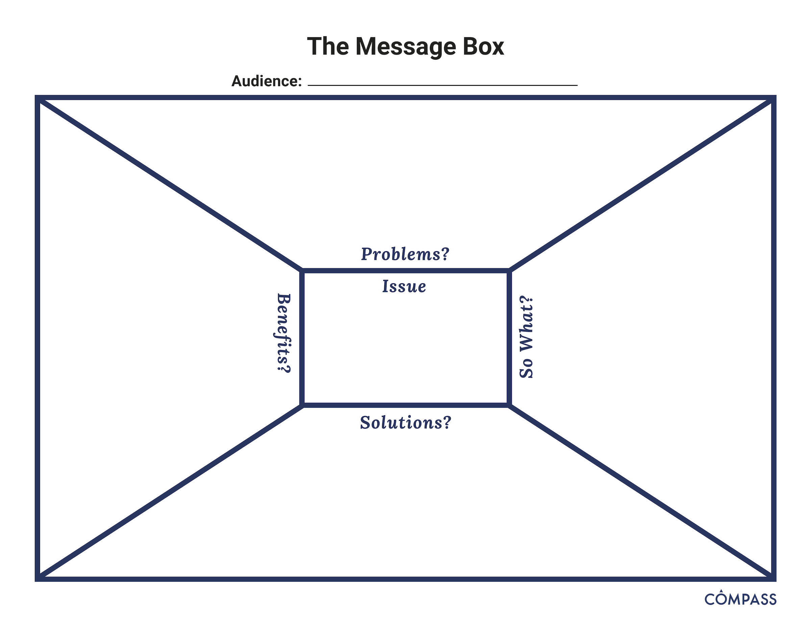

# Communication Principles

**In this Session**

1. Learning Objectives
2. Prioritizing Engagement
3. Crafting your message
4. Salience, Credibility and Legitimacy
5. Crafting your Message
6. [Practice Exercise: Fill Out The Message Box](#the-message-box) 
7. Resources

## Learning Objectives

1. Approach science communication from an engagement framework
2. Utilize tools like the "Message Box" for developing and crafting your message (Practice Exercise)

## Prioritizing Engagement

1. Science communication is more than dumping information on your audience. Rather, a successful communication approach will include learning what your audience desires and needs as well as building a relationship with the community you are trying to reach in order to anticipate future interests.

2. In this module we present an engagement model of communication. In a deficit model of communication information flows one way. The scientist presents new information to an audience. On the other hand, an engagement model relies on including members of your audience as active collaborators in knowledge-building. Successful engagement means building trust and long-term relationships with the audience you hope to reach.

Source: Twitter @TheComNetwork

## Salience, Credibility and Legitimacy: Cornerstones of Effective Communication

  1. A focal point in effective communication to inform decision making is to consider the perceived salience, credibility, and legitimacy of the information from your audience’s perspective ([Cash et. al. 2002](https://dash.harvard.edu/bitstream/handle/1/32067415/Salience_credibility.pdf?sequence=4)). Another way to think of these terms could be the “when,” “who,” and “how” of the information provided.
  
  - Salience: “... the relevance of information for an actor’s decision choices.” 
      - Ensure that the content you are providing is relevant to the decisions that your audience members encounter in a time frame that meets their needs. For example, there is limited value in informing a tourist that traveled to a beach that the water quality was unhealthy a week after they visited. Rather, aim to anticipate the needs of your audience members such that you can provide digestible information right when they need it.
  - Credibility: “...whether an actor perceives information as meeting standards of scientific plausibility and technical adequacy.” 
     - The reputation of an organization or individual is of paramount importance when providing actionable information. Ensuring that “honest brokers of unbiased information” are the leading communicators enhances the perceived credibility of the information. This “credibility” consideration extends to every member of an organization or collaborative working group involved. Furthermore, after a period of time, audience members may desire to reflect on the accuracy of previous statements to gain an understanding of “how often have they been right?” 
   - Legitimacy: “...whether an actor perceives the process in a system as unbiased and meeting standards of political and procedural fairness.” 
     - In many cases, audience members strongly consider how the information was collected, analyzed and conveyed - as well as the process for engaging communities that are most closely tied to the content. This requires transparency in the process and ensuring that perspectives of impacted stakeholders are integrated into the overall message.

## Crafting your message

 1. In order to create messages that stick, brainstorm your call to action and draft your core message.

Messages are intended to **lead your audience to action.**

  - _Key term: _**Call to Action (CTA)**
  - What is the action you want to motivate people to?

Write before you write.

> "Consider and articulate what your story is really about. Not the noun, the verb. It's not enough to say your story is about, say, salmon. Is it a story about bears that eat salmon? Salmon that eat bears?" - Michelle Nijhuis in The Science Writers' Handbook: Everything You Need to Know to Pitch, Publish, and Prosper in the Digital Age (2013)

  2. ***Good messages ...***
  
  - Invite your audience into conversation
  
    - Avoid jargon
     - Instead, use descriptive language that your audience would be familiar with
     - When you can’t find a perfect synonym for a jargon term, define the term or provide an analogy to something they are familiar with. 
     - Consider these examples of “jargony” terms and their “audience-friendly” counterparts:
        - Anthropogenic → human-caused
        - Ecosystem services → benefits from nature
        - Harmful algal blooms → outbreak of toxic algae
        - Submerged aquatic vegetation → underwater grasses
     - We want to make our messages accessible by leveraging our audience’s existing knowledge and framing the language to be socially and culturally relevant. Note that this approach is distinct from simply “dumbing down” the content.
  
    
  - Share about yourself to connect to their values, interests, and concerns.
    - By sharing details about yourself and your background you can build trust with your audience and relate to them on a deeper level. Personal stories and connections can aid in establishing credibility and an attachment to the issue.
 
    
  - Help people see themselves in your story. 
    - Find compelling hooks. A hook is the first part of a story that pulls people in. It conveys the significance and entices readers to keep reading. 
      - For example: Why is it important now? What makes this story timely?
      - Can I tell this message through a story? People gravitate to stories and narrative structures. A good story captivates an audience's attention and makes the message memorable.

  
## The Message Box

1. In preparing to communicate your scientific information, consider the use of targeted tools or practices to best focus your messages. One of the most popular tools in the science communication field is the Message Box - developed and shared by [COMPASS](https://www.compassscicomm.org/about-us/).

2. The [Message Box](https://www.compassscicomm.org/leadership-development/the-message-box/) is a tool that helps researchers take the information they hold about their research and communicate it in a way that resonates with the chosen audience. It can be used to help prepare for interviews with journalists or employers, plan for a presentation, outline a paper or lecture, prepare a grant proposal, or clearly, and with relevancy, communicate your work to others. While the message box _can_ be used in all these ways, you must first identify the audience for your communication as that will drive your messaging. You would have a very different delivery for a group of scientists compared to a group of school children even with the same core message.

The Message Box comprises five sections to help you sort and distill your knowledge in a way that will resonate with your (chosen) audience. How we communicate with other scientists (through scholarly publications) is not how the rest of the rest of the world typically communicates.

 
In a scientific paper, we establish credibility in the introduction and methods, provide detailed data and results, and then share the significance of our work in the discussion and conclusions. But the rest of the world leads with the impact, the take home message. A quick glance of newspaper headlines demonstrates this. 

 
The five sections of the Message Box are provided below. For a detailed explanation of the sections and guidance on how to use the Message Box, work through the [Message Box Workbook](https://www.compassscicomm.org/wp-content/uploads/2020/05/The-Message-Box-Workbook.pdf).

 3. Message Box Sections
 
**The Issue**

  - The "Issue" section in the center of the box identifies and describes the overarching issue or topic that you're addressing in broad terms. It's the big-picture context of your work. This should be very concise and clear; no more than a short phrase. You might find you revisit the Issue after you've filled out your Message Box, to see if your thinking on the overarching topic has changed since you started.
  
**The Problem**

  - The "Problem" is the chunk of the broader issue that you're addressing in your area of expertise. It's your piece of the pie, reflecting your work and expert knowledge. Think about your research questions and what aspect of the specific problem you're addressing would matter to your audience. The Problem is also where you set up the "So What" and describe the situation you see and want to address.
  
**The So What**

  - The crux of the Message Box, and the critical question the COMPASS team seeks to help scientists answer, is "So what?" Why should your audience care? What about your research or work is important for them to know? Why are you talking to them about it? The answer to this question may change from audience to audience, and you'll want to be able to adjust based on their interests and needs.
  
  - We like to use the analogy of putting a message through a prism that clarifies the importance to different audiences. Each audience will be interested in different facets of your work, and you want your message to reflect their interests and accommodate their needs. The prism below includes a spectrum of audiences you might want to reach, and some of the questions they might have about your work.
  
 
 
 **The Solution**

  - The Solution section outlines the options for solving the problem you identified. When presenting possible solutions, consider whether they are something your audience can influence or act upon. And remind yourself of your communication goals: Why are you communicating with this audience? What do you want to accomplish?
  
**The Benefit**

  - In the Benefit section, you list the benefits of addressing the Problem — all the good things that could happen if your Solution section is implemented. This ties into the So What of why your audience cares, but focuses on the positive results of taking action (the "So What?" may be a negative thing — for example, inaction could lead to consequences that your audience cares about). If possible, it can be helpful to be specific here — concrete examples are more compelling than abstract. Who is likely to benefit, and where, and when?
  
 - In addition to the [Message Box Workbook](https://www.compassscicomm.org/wp-content/uploads/2020/05/The-Message-Box-Workbook.pdf), COMPASS have resources on how to [increase the impact](https://www.compassscicomm.org/practice/) of your message (include important statistics, draw comparisons, reduce jargon, use examples), exercises for practicing and [refining](https://www.compassscicomm.org/compare/) your message and published [examples](https://www.compassscicomm.org/examples/).

## Practice Exercise: Fill Out The Message Box

1. For your own practice, fill out a sample Message Box with an example audience from your own work (e.g. a local school, government agency, or even internal leadership). You can [download a blank message box](files/Message-Box-Blank.pdf) or draft your own.

    - Fill in your audience at the top of the Message Box.
    - Fill out the Message Boxes 5 sections: "Issue", "Problems", "So What?", "Solutions", and "Benefits".
    - Practice providing your talking points for your latest project with a colleagues

## Resources

1. If you'd like to learn more watch [DataONE Webinar: Communication Strategies to Increase Your Impact](https://vimeo.com/323261612) from [DataONE](https://vimeo.com/dataoneorg) on [Vimeo](https://vimeo.com/).

<iframe src="https://player.vimeo.com/video/323261612?badge=0&amp;autopause=0&amp;player_id=0&amp;app_id=58479&amp;h=2dc6b6a91a" frameborder="0" allow="autoplay; fullscreen; picture-in-picture" allowfullscreen style="position:absolute;top:0;left:0;width:100%;height:100%;" title="DataONE Webinar: Communication Strategies to Increase Your Impact"></iframe>

# Data Storytelling

**In this Session**

1. Learning Objectives
2. Value Statement
3. New Terms
4. Receive Your Data
5. Identifying Your Audience
6. Understand Key Insights
7. Connect Stories to Key Insights
8. Utilize Engaging Visuals
9. Share Your Data Stories
10. Summary

## Learning Objectives

### Test of subheaders in navigation bar
