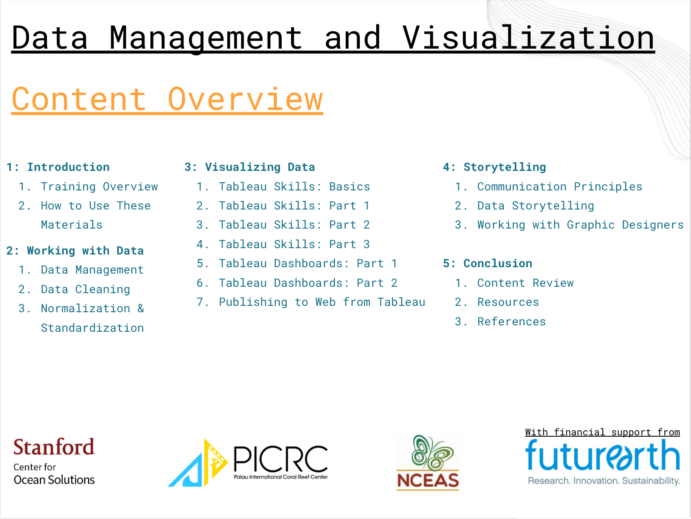

--- 
title: "Data Management and Visualization Training"
author: "Stanford Center for Open Solutions, National Center for Ecological Analysis and Synthesis"
date: "`r Sys.Date()`"
site: bookdown::bookdown_site
documentclass: book
# url: your book url like https://bookdown.org/yihui/bookdown
# cover-image: path to the social sharing image like images/cover.jpg
description: Materials for the Stanford and NCEAS PICRC Training
link-citations: yes
github-repo: rstudio/bookdown-demo
---

# Introduction to Course

**In this Session**

1. Training Overview
2. Structural Approach for Using the Material

## Training Overview

1. ***Relevance:*** As environmental issues increase in scale and scope, there will be an increasing need to “tell the story” of monitoring and conservation efforts. To address this need, data enthusiasts - such as you - have an opportunity to expand their knowledge base in working with complex data sets to creatively convey impactful, data-driven messages to a variety of audiences. This compilation of training materials is intended to provide an accessible, digestible resource for anyone interested in any aspect of data management or visualization.

2. ***Background:*** This compilation of data management and visualization training materials stems from a multi-year engagement amongst the Palau International Coral Reef Center ([PICRC](https://picrc.org/picrcpage/)), the Stanford Center for Ocean Solutions ([COS](https://oceansolutions.stanford.edu/)), and the National Center for Ecological Analysis and Synthesis ([NCEAS](https://www.nceas.ucsb.edu/)) through financial support by [Future Earth](https://futureearth.org/). The funding supported a collaborative working group requested by former Palauan President, Tommy Remengesau, Jr. to investigate major implications of the full implementation of the Palau National Marine Sanctuary and compile a report of the findings (see [PICRC page](https://picrc.org/picrcpage/palau-national-marine-sanctuary/) or [COS page](https://oceansolutions.stanford.edu/pnms-report)). One key lesson from that experience was the importance of enhancing the capacity for managing and visualizing data driven messages to more effectively communicate significant management findings.

3. ***Content:*** In this training package, you will learn about three core elements of data management and visualization.

    - *Chapter 2: Working with Data* - including management of data resources, cleaning datasets, and normalizing & standardizing data sets and databases.
    - *Chapter 3: Visualizing Data* - including a focus on using Tableau software to build or enhance visualization skills and resources.
    - *Chapter 4: Communicating Data Stories* - including core principles in overall data communication, lessons in building and telling stories using your data sets, and working with external partners on visuals (such as graphic designers).
    - The concluding module (*Chapter 5*) includes a collection of final messages and resources to aid you in your path forward.
    

4. ***Intended audience:*** In recognizing the wide range of roles and responsibilities individuals may have with respect to data use within an organization, this training is designed to be completed either in a sequence of all sessions from beginning to end or compartmentalized in modules and sessions to focus on specific skills. Whether you are a data novice interested in learning about all aspects of management and visualization, a data nerd who wants to learn more about visualization and communication, or a communications wizard who wants to be more familiar with data details or skills - this training package includes material to advance your understanding. This content is intended to equip you to better utilize and communicate data stories. In preparation for this course, it may help to briefly consider which data role(s) from the non-exhaustive list below best describes your interests and which lessons best suit your position and needs. 

5. ***Authors:*** This Data Management and Visualization Training package is a collaborative effort amongst researchers and staff from PICRC, NCEAS, and COS. The core contributors to the existing content are recognized below.

<iframe width="560" height="425" src="files/Intro_data_training_authors.pdf" frameborder="0" allowfullscreen></iframe>

## How to Use These Materials

1. ***Overview:*** The content in the three core modules of this training package targets an audience of researchers or communicators seeking to build their  skill set. Each chapter contains links to additional sessions or resources for those that are interested in deeper topical dives. 

2. ***Materials:*** Some sessions include distilled handouts or briefs as well as short exercises to help you practice the skills while you are developing them.

3. ***Briefs:*** Documents that can be utilized as a standalone resource - compiling core messages from a session.

4. ***Exercises:*** Self-guided practical work to facilitate learning and enable exploration from a more conceptual framework. 

5. ***Video Tutorials:*** Recorded lessons (primarily in Chapter 4: Tableau) providing stepwise guidance to the interface and content.

6. ***Iteration:*** As previously mentioned, the content in this training package is intended to be revisited on an iterative basis as needed. You can proceed through the content in sequence or focus on the chapters or sessions of most interest to you. Regardless of your specific data-related role in an organization, there are opportunities to gain greater mastery through iterative practice and collaborative learning.

7. ***Conclusion:*** The concluding chapter (Chapter 5) includes a compilation of resources for “at-a-glance” skill reminders and references for further investigation.
